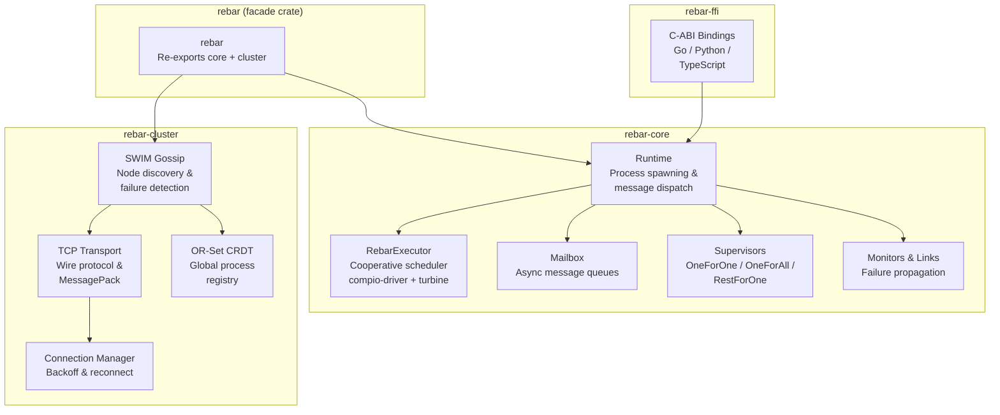

# Rebar

**A BEAM-inspired distributed actor runtime for Rust**

---

## Why Rebar?

Rebar brings Erlang/OTP's battle-tested actor model to Rust. It provides lightweight processes with mailbox messaging, supervision trees for fault tolerance, location-transparent messaging across nodes, SWIM-based clustering for automatic node discovery, and polyglot FFI so you can embed actor systems in Go, Python, and TypeScript applications.

## Feature Highlights

- **Custom cooperative executor** — RebarExecutor built on compio-driver for cross-platform async I/O
- **Thread-per-core architecture** — Each OS thread runs its own RebarExecutor + ProcessTable with !Send semantics
- **Turbine buffer pool integration** — Epoch-based IouringBufferPool for zero-copy I/O via turbine-core
- **Lightweight processes** — Spawn thousands of async processes, each with its own mailbox
- **Supervision trees** — OneForOne, OneForAll, and RestForOne restart strategies with configurable thresholds
- **Process monitoring & linking** — Bidirectional failure propagation between related processes
- **SWIM gossip protocol** — Automatic node discovery and failure detection across the cluster
- **TCP transport with wire protocol** — Efficient binary serialization using MessagePack
- **OR-Set CRDT registry** — Conflict-free global process registry that converges across nodes
- **Connection manager** — Exponential backoff reconnection with jitter
- **C-ABI FFI bindings** — Call into the actor runtime from Go, Python, and TypeScript via a stable C interface
- **~170 passing tests** — Comprehensive test coverage in rebar-core

### Client Libraries

Idiomatic wrappers for embedding Rebar in Go, Python, and TypeScript applications:

| Language | Package | Actor Pattern |
|----------|---------|--------------|
| Go | `clients/go/` | `Actor` interface with `HandleMessage(ctx, msg)` |
| Python | `clients/python/` | `Actor` ABC with `handle_message(ctx, msg)` |
| TypeScript | `clients/typescript/` | `Actor` abstract class with `handleMessage(ctx, msg)` |

See [Client Libraries](clients/README.md) for build instructions.

## Architecture Overview



## Quick Start

Add Rebar to your `Cargo.toml`:

```toml
[dependencies]
rebar-core = { path = "rebar-core" }
rmpv = "1"
```

### Spawn a Process and Send a Message

```rust
use rebar_core::runtime::Runtime;
use rebar_core::executor::RebarExecutor;
use std::rc::Rc;

fn main() {
    let mut executor = RebarExecutor::new(Default::default()).unwrap();
    executor.block_on(async {
        let runtime = Rc::new(Runtime::new(1, 0));

        // Spawn a process
        let pid = runtime.spawn(|mut ctx| async move {
            println!("Hello from {:?}", ctx.self_pid());
            while let Some(msg) = ctx.recv().await {
                println!("Got: {:?}", msg.payload());
            }
        });

        // Send a message
        runtime.send(pid, rmpv::Value::from("hello")).unwrap();
    });
}
```

### Supervisor Tree

```rust
use rebar_core::supervisor::*;
use rebar_core::runtime::Runtime;
use std::rc::Rc;

let runtime = Rc::new(Runtime::new(1, 0));
let spec = SupervisorSpec::new(RestartStrategy::OneForOne)
    .max_restarts(5)
    .max_seconds(60);
let handle = start_supervisor(runtime.clone(), spec, vec![]).await;
```

## Benchmark Results

HTTP microservices mesh benchmark (3 services, 2 CPU / 512MB per container):

| Metric | Rebar | Actix | Go | Elixir |
|---|---|---|---|---|
| Throughput (c=100) | 12,332 req/s | 13,175 req/s | 642 req/s | 3,410 req/s |
| Latency P50 | 8.44ms | 9.02ms | 54.98ms | 28.78ms |
| Latency P99 | 16.95ms | 17.71ms | 866ms | 47.28ms |

See [Benchmarks](docs/benchmarks.md) for full methodology and results.

## Project Status

- [x] Process spawning with mailbox messaging
- [x] Supervisor trees (OneForOne/OneForAll/RestForOne)
- [x] Process monitoring and linking
- [x] **Custom cooperative executor** — RebarExecutor replacing Tokio, built on compio-driver + turbine-core with thread-per-core !Send architecture
- [x] SWIM gossip protocol for node discovery
- [x] TCP transport with wire protocol
- [x] OR-Set CRDT global process registry
- [x] Connection manager with exponential backoff
- [x] C-ABI FFI bindings
- [x] QUIC transport (`quinn`-based, replacing TCP as production default)
- [x] Distribution layer integration (cluster <-> core, transparent remote `send()`)
- [x] Graceful node drain (coordinated shutdown with state migration)

## Documentation

- [Architecture](docs/architecture.md)
- [Getting Started](docs/getting-started.md)
- [Extending Rebar](docs/extending.md)
- API Reference: [rebar-core](docs/api/rebar-core.md) | [rebar-cluster](docs/api/rebar-cluster.md) | [rebar-ffi](docs/api/rebar-ffi.md)
- Internals: [Wire Protocol](docs/internals/wire-protocol.md) | [SWIM](docs/internals/swim-protocol.md) | [CRDT Registry](docs/internals/crdt-registry.md) | [Supervisors](docs/internals/supervisor-engine.md)
- [Benchmarks](docs/benchmarks.md)
- [Future Extensions](docs/future.md)

## License

MIT
