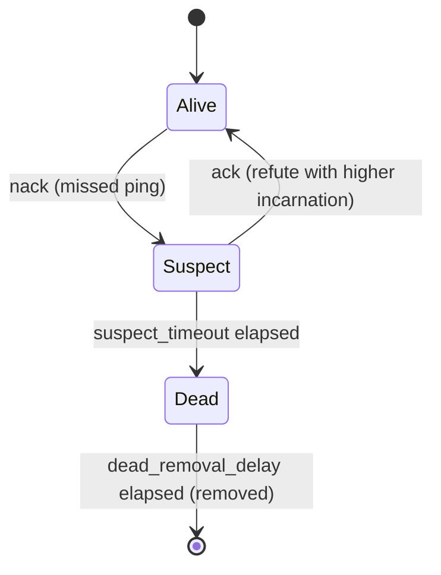

# rebar-cluster API Reference

`rebar-cluster` is the distributed networking layer for the Rebar runtime. It provides wire protocol framing, pluggable transports, SWIM-based failure detection and membership gossip, an OR-Set CRDT process name registry, and connection management with exponential-backoff reconnection.

**Crate:** `rebar-cluster`
**Path:** `crates/rebar-cluster/`

---

## Table of Contents

- [protocol](#protocol) -- Wire protocol framing and message types
- [transport](#transport) -- Async transport traits and TCP implementation
- [swim](#swim) -- SWIM failure detection, membership, gossip
- [registry](#registry) -- OR-Set CRDT global process name registry
- [connection](#connection) -- Connection lifecycle and reconnection

---

## protocol

**Module:** `crates/rebar-cluster/src/protocol/`

Wire protocol encoding and decoding. Every inter-node message is serialized as a `Frame` with a fixed 18-byte header followed by MessagePack-encoded header and payload sections.

### Frame

A wire protocol frame. All inter-node communication is encoded as frames.

**Definition:**

```rust
pub struct Frame {
    pub version: u8,
    pub msg_type: MsgType,
    pub request_id: u64,
    pub header: rmpv::Value,
    pub payload: rmpv::Value,
}
```

**Wire format (18-byte fixed header):**

| Offset | Size | Field |
|--------|------|-------|
| 0 | 1 | `version` (u8) |
| 1 | 1 | `msg_type` (u8) |
| 2 | 8 | `request_id` (u64, big-endian) |
| 10 | 4 | `header_len` (u32, big-endian) |
| 14 | 4 | `payload_len` (u32, big-endian) |
| 18 | header_len | MessagePack-encoded header |
| 18 + header_len | payload_len | MessagePack-encoded payload |

**Methods:**

| Method | Signature | Description |
|--------|-----------|-------------|
| `encode` | `fn encode(&self) -> Vec<u8>` | Serialize the frame into bytes using the wire format above. |
| `decode` | `fn decode(bytes: &[u8]) -> Result<Self, FrameError>` | Deserialize a frame from bytes. Returns `FrameError` on invalid or truncated input. |

**Example:**

```rust
use rebar_cluster::protocol::{Frame, MsgType};

let frame = Frame {
    version: 1,
    msg_type: MsgType::Send,
    request_id: 42,
    header: rmpv::Value::Map(vec![
        (rmpv::Value::String("dest".into()), rmpv::Value::Integer(7.into())),
    ]),
    payload: rmpv::Value::String("hello".into()),
};

let bytes = frame.encode();
let decoded = Frame::decode(&bytes).unwrap();
assert_eq!(decoded.msg_type, MsgType::Send);
assert_eq!(decoded.request_id, 42);
```

---

### MsgType

Wire protocol message types. Each variant maps to a `u8` discriminant used on the wire.

**Definition:**

```rust
#[derive(Clone, Copy, PartialEq, Eq, Debug)]
#[repr(u8)]
pub enum MsgType {
    Send            = 0x01,
    Monitor         = 0x02,
    Demonitor       = 0x03,
    Link            = 0x04,
    Unlink          = 0x05,
    Exit            = 0x06,
    ProcessDown     = 0x07,
    NameLookup      = 0x08,
    NameRegister    = 0x09,
    NameUnregister  = 0x0A,
    Heartbeat       = 0x0B,
    HeartbeatAck    = 0x0C,
    NodeInfo        = 0x0D,
}
```

**Variants:**

| Variant | Value | Purpose |
|---------|-------|---------|
| `Send` | `0x01` | Deliver a message to a remote process |
| `Monitor` | `0x02` | Establish a process monitor |
| `Demonitor` | `0x03` | Remove a process monitor |
| `Link` | `0x04` | Create a bidirectional process link |
| `Unlink` | `0x05` | Remove a bidirectional process link |
| `Exit` | `0x06` | Signal a process exit |
| `ProcessDown` | `0x07` | Notify that a monitored process has exited |
| `NameLookup` | `0x08` | Look up a registered process name |
| `NameRegister` | `0x09` | Register a process name |
| `NameUnregister` | `0x0A` | Unregister a process name |
| `Heartbeat` | `0x0B` | Heartbeat probe |
| `HeartbeatAck` | `0x0C` | Heartbeat acknowledgement |
| `NodeInfo` | `0x0D` | Exchange node metadata |

**Methods:**

| Method | Signature | Description |
|--------|-----------|-------------|
| `from_u8` | `fn from_u8(v: u8) -> Result<Self, FrameError>` | Convert a raw byte to a `MsgType`. Returns `FrameError::InvalidMsgType` for unknown values. |

**Example:**

```rust
use rebar_cluster::protocol::MsgType;

let msg_type = MsgType::from_u8(0x0B).unwrap();
assert_eq!(msg_type, MsgType::Heartbeat);

let err = MsgType::from_u8(0xFF);
assert!(err.is_err()); // InvalidMsgType(0xFF)
```

---

### FrameError

Errors that can occur during frame encoding or decoding.

**Definition:**

```rust
#[derive(Debug, Error)]
pub enum FrameError {
    #[error("invalid message type: {0}")]
    InvalidMsgType(u8),

    #[error("frame too short: need at least {expected} bytes, got {actual}")]
    TooShort { expected: usize, actual: usize },

    #[error("msgpack decode error: {0}")]
    MsgpackDecode(String),

    #[error("msgpack encode error: {0}")]
    MsgpackEncode(String),
}
```

**Variants:**

| Variant | Fields | Cause |
|---------|--------|-------|
| `InvalidMsgType` | `u8` | Byte does not map to any known `MsgType` variant |
| `TooShort` | `expected: usize, actual: usize` | Input buffer shorter than required |
| `MsgpackDecode` | `String` | MessagePack deserialization failed |
| `MsgpackEncode` | `String` | MessagePack serialization failed |

---

## transport

**Module:** `crates/rebar-cluster/src/transport/`

Async transport traits and a TCP implementation. The trait-based design allows plugging in different transports (TCP, QUIC, mock) without changing higher-level code.

### TransportConnection

Async trait for a single bidirectional connection.

**Definition:**

```rust
#[async_trait]
pub trait TransportConnection: Send + Sync {
    async fn send(&mut self, frame: &Frame) -> Result<(), TransportError>;
    async fn recv(&mut self) -> Result<Frame, TransportError>;
    async fn close(&mut self) -> Result<(), TransportError>;
}
```

**Methods:**

| Method | Signature | Description |
|--------|-----------|-------------|
| `send` | `async fn send(&mut self, frame: &Frame) -> Result<(), TransportError>` | Send a frame over the connection. |
| `recv` | `async fn recv(&mut self) -> Result<Frame, TransportError>` | Receive the next frame. Blocks until a frame arrives or the connection closes. |
| `close` | `async fn close(&mut self) -> Result<(), TransportError>` | Shut down the connection. |

---

### TransportListener

Async trait for accepting incoming connections.

**Definition:**

```rust
#[async_trait]
pub trait TransportListener: Send + Sync {
    type Connection: TransportConnection;

    fn local_addr(&self) -> SocketAddr;
    async fn accept(&self) -> Result<Self::Connection, TransportError>;
}
```

**Methods:**

| Method | Signature | Description |
|--------|-----------|-------------|
| `local_addr` | `fn local_addr(&self) -> SocketAddr` | Return the local address the listener is bound to. |
| `accept` | `async fn accept(&self) -> Result<Self::Connection, TransportError>` | Accept the next incoming connection. |

---

### TransportError

Errors from transport operations.

**Definition:**

```rust
#[derive(Debug, Error)]
pub enum TransportError {
    #[error("io error: {0}")]
    Io(#[from] std::io::Error),

    #[error("connection closed")]
    ConnectionClosed,

    #[error("frame error: {0}")]
    Frame(#[from] crate::protocol::FrameError),
}
```

**Variants:**

| Variant | Fields | Cause |
|---------|--------|-------|
| `Io` | `std::io::Error` | Underlying I/O error |
| `ConnectionClosed` | -- | Remote side closed the connection |
| `Frame` | `FrameError` | Frame decoding failed on received data |

---

### TcpTransport

TCP transport using length-prefixed framing. Each frame on the wire is preceded by a 4-byte big-endian length prefix.

**Wire format:**

```
+----------+--------------+
| len: u32 | payload: [u8]|
+----------+--------------+
```

**Definition:**

```rust
pub struct TcpTransport;
```

**Methods:**

| Method | Signature | Description |
|--------|-----------|-------------|
| `new` | `fn new() -> Self` | Create a new `TcpTransport` instance. |
| `listen` | `async fn listen(&self, addr: SocketAddr) -> Result<TcpTransportListener, TransportError>` | Bind to an address and start listening. |
| `connect` | `async fn connect(&self, addr: SocketAddr) -> Result<TcpConnection, TransportError>` | Connect to a remote address. |

**Example:**

```rust
use rebar_cluster::transport::TcpTransport;
use rebar_cluster::protocol::{Frame, MsgType};

let transport = TcpTransport::new();
let listener = transport.listen("127.0.0.1:0".parse().unwrap()).await?;
let addr = listener.local_addr();

// Server side
let server = tokio::spawn(async move {
    let mut conn = listener.accept().await.unwrap();
    let frame = conn.recv().await.unwrap();
    assert_eq!(frame.msg_type, MsgType::Heartbeat);
});

// Client side
let mut client = transport.connect(addr).await?;
let frame = Frame {
    version: 1,
    msg_type: MsgType::Heartbeat,
    request_id: 0,
    header: rmpv::Value::Nil,
    payload: rmpv::Value::Nil,
};
client.send(&frame).await?;
client.close().await?;
server.await.unwrap();
```

---

### TcpTransportListener

TCP listener returned by `TcpTransport::listen`. Implements `TransportListener`.

**Definition:**

```rust
pub struct TcpTransportListener {
    inner: TcpListener,  // tokio::net::TcpListener
}
```

**Implements:** `TransportListener` with `type Connection = TcpConnection`

---

### TcpConnection

A single TCP connection. Implements `TransportConnection`.

**Definition:**

```rust
pub struct TcpConnection {
    stream: TcpStream,  // tokio::net::TcpStream
}
```

**Implements:** `TransportConnection`

---

## swim

**Module:** `crates/rebar-cluster/src/swim/`

SWIM (Scalable Weakly-consistent Infection-style process group Membership) protocol implementation. Provides failure detection, membership tracking, and gossip dissemination.

### NodeState

The state of a cluster member in the SWIM protocol.

**Definition:**

```rust
#[derive(Debug, Clone, Copy, PartialEq, Eq)]
pub enum NodeState {
    Alive,
    Suspect,
    Dead,
}
```

**State transitions:**



> Note: Once a member enters the `Dead` state, it cannot transition back to `Alive` or `Suspect`.

---

### Member

A single cluster member tracked by the SWIM protocol.

**Definition:**

```rust
#[derive(Debug, Clone)]
pub struct Member {
    pub node_id: u64,
    pub addr: SocketAddr,
    pub state: NodeState,
    pub incarnation: u64,
}
```

**Methods:**

| Method | Signature | Description |
|--------|-----------|-------------|
| `new` | `fn new(node_id: u64, addr: SocketAddr) -> Self` | Create a new member in `Alive` state with incarnation `0`. |
| `suspect` | `fn suspect(&mut self, incarnation: u64)` | Mark as `Suspect` if incarnation >= current and not `Dead`. |
| `alive` | `fn alive(&mut self, incarnation: u64)` | Mark as `Alive` if incarnation > current and not `Dead`. |
| `dead` | `fn dead(&mut self)` | Mark as `Dead`. Irreversible. |

**Example:**

```rust
use rebar_cluster::swim::{Member, NodeState};

let mut member = Member::new(1, "127.0.0.1:4000".parse().unwrap());
assert_eq!(member.state, NodeState::Alive);
assert_eq!(member.incarnation, 0);

member.suspect(0);
assert_eq!(member.state, NodeState::Suspect);

// Refute with higher incarnation
member.alive(1);
assert_eq!(member.state, NodeState::Alive);
assert_eq!(member.incarnation, 1);

// Dead is permanent
member.dead();
member.alive(100);
assert_eq!(member.state, NodeState::Dead);
```

---

### MembershipList

A collection of cluster members indexed by `node_id`.

**Definition:**

```rust
pub struct MembershipList {
    members: HashMap<u64, Member>,
}
```

**Methods:**

| Method | Signature | Description |
|--------|-----------|-------------|
| `new` | `fn new() -> Self` | Create an empty membership list. |
| `add` | `fn add(&mut self, member: Member)` | Insert or replace a member by `node_id`. |
| `get` | `fn get(&self, node_id: u64) -> Option<&Member>` | Look up a member by ID. |
| `get_mut` | `fn get_mut(&mut self, node_id: u64) -> Option<&mut Member>` | Look up a member mutably by ID. |
| `mark_dead` | `fn mark_dead(&mut self, node_id: u64)` | Mark a member as `Dead` if present. |
| `remove_dead` | `fn remove_dead(&mut self)` | Remove all members in `Dead` state. |
| `remove_node` | `fn remove_node(&mut self, node_id: u64)` | Remove a specific member by ID. |
| `alive_count` | `fn alive_count(&self) -> usize` | Count members in `Alive` state. |
| `random_alive_member` | `fn random_alive_member(&self, exclude: u64) -> Option<Member>` | Pick a random `Alive` member, excluding the given node ID. Returns `None` if no candidates exist. |
| `all_members` | `fn all_members(&self) -> impl Iterator<Item = &Member>` | Iterate over all members regardless of state. |

**Example:**

```rust
use rebar_cluster::swim::{Member, MembershipList};

let mut list = MembershipList::new();
list.add(Member::new(1, "127.0.0.1:4001".parse().unwrap()));
list.add(Member::new(2, "127.0.0.1:4002".parse().unwrap()));
list.add(Member::new(3, "127.0.0.1:4003".parse().unwrap()));

assert_eq!(list.alive_count(), 3);

list.mark_dead(2);
assert_eq!(list.alive_count(), 2);

// Pick a random alive member, excluding self (node 0)
if let Some(target) = list.random_alive_member(0) {
    println!("Probing node {}", target.node_id);
}
```

---

### SwimConfig

Configuration for the SWIM protocol.

**Definition:**

```rust
#[derive(Debug, Clone)]
pub struct SwimConfig {
    pub protocol_period: Duration,
    pub suspect_timeout: Duration,
    pub dead_removal_delay: Duration,
    pub indirect_probe_count: usize,
    pub max_gossip_per_tick: usize,
}
```

**Fields:**

| Field | Type | Default | Description |
|-------|------|---------|-------------|
| `protocol_period` | `Duration` | 1s | How often the protocol runs a probe cycle. |
| `suspect_timeout` | `Duration` | 5s | How long a node stays in `Suspect` before being declared `Dead`. |
| `dead_removal_delay` | `Duration` | 30s | How long a `Dead` node is kept before removal from the membership list. |
| `indirect_probe_count` | `usize` | 3 | Number of indirect probes to send when a direct probe fails. |
| `max_gossip_per_tick` | `usize` | 8 | Maximum gossip messages piggy-backed per protocol tick. |

**Methods:**

| Method | Signature | Description |
|--------|-----------|-------------|
| `builder` | `fn builder() -> SwimConfigBuilder` | Return a new builder initialized with default values. |

**Implements:** `Default`

**Example:**

```rust
use rebar_cluster::swim::SwimConfig;
use std::time::Duration;

// Use defaults
let config = SwimConfig::default();
assert_eq!(config.protocol_period, Duration::from_secs(1));

// Use the builder for custom values
let config = SwimConfig::builder()
    .protocol_period(Duration::from_millis(500))
    .suspect_timeout(Duration::from_secs(10))
    .dead_removal_delay(Duration::from_secs(60))
    .indirect_probe_count(5)
    .max_gossip_per_tick(16)
    .build();
```

---

### SwimConfigBuilder

Builder for `SwimConfig`. All methods consume and return `self` for chaining.

**Definition:**

```rust
#[derive(Debug, Clone)]
pub struct SwimConfigBuilder {
    config: SwimConfig,
}
```

**Methods:**

| Method | Signature | Description |
|--------|-----------|-------------|
| `protocol_period` | `fn protocol_period(mut self, d: Duration) -> Self` | Set the protocol period. |
| `suspect_timeout` | `fn suspect_timeout(mut self, d: Duration) -> Self` | Set the suspect timeout. |
| `dead_removal_delay` | `fn dead_removal_delay(mut self, d: Duration) -> Self` | Set the dead removal delay. |
| `indirect_probe_count` | `fn indirect_probe_count(mut self, n: usize) -> Self` | Set the indirect probe count. |
| `max_gossip_per_tick` | `fn max_gossip_per_tick(mut self, n: usize) -> Self` | Set the maximum gossip per tick. |
| `build` | `fn build(self) -> SwimConfig` | Consume the builder and return the config. |

**Implements:** `Default`

---

### FailureDetector

Drives the SWIM failure-detection state machine. Tracks suspect timers and dead timers, selecting probe targets and managing state transitions.

**Definition:**

```rust
pub struct FailureDetector {
    suspect_timers: HashMap<u64, Instant>,  // node_id -> when first suspected
    dead_timers: HashMap<u64, Instant>,     // node_id -> when declared dead
}
```

**Methods:**

| Method | Signature | Description |
|--------|-----------|-------------|
| `new` | `fn new() -> Self` | Create a new failure detector with empty timer maps. |
| `tick` | `fn tick(&self, members: &MembershipList, self_id: u64) -> Option<u64>` | Select a random alive or suspect member to probe, excluding `self_id`. Returns `None` if no targets are available. |
| `record_ack` | `fn record_ack(&mut self, members: &mut MembershipList, node_id: u64)` | Record that a node responded. If the node was `Suspect`, moves it back to `Alive` with an incremented incarnation and removes its suspect timer. |
| `record_nack` | `fn record_nack(&mut self, members: &mut MembershipList, node_id: u64, now: Instant)` | Record that a node did not respond. If the node was `Alive`, marks it `Suspect` and starts a suspect timer. |
| `check_suspect_timeouts` | `fn check_suspect_timeouts(&mut self, members: &mut MembershipList, config: &SwimConfig, now: Instant) -> Vec<u64>` | Check all suspect timers against `config.suspect_timeout`. Declares timed-out nodes `Dead` and returns their IDs. |
| `remove_expired_dead` | `fn remove_expired_dead(&mut self, members: &mut MembershipList, config: &SwimConfig, now: Instant) -> Vec<u64>` | Remove dead nodes whose `dead_removal_delay` has elapsed. Returns the IDs of removed nodes. |
| `suspect_timers` | `fn suspect_timers(&self) -> &HashMap<u64, Instant>` | Return the suspect timer map (for diagnostics). |

**Example:**

```rust
use rebar_cluster::swim::{FailureDetector, Member, MembershipList, SwimConfig};
use std::time::Instant;

let mut members = MembershipList::new();
members.add(Member::new(1, "127.0.0.1:4001".parse().unwrap()));
members.add(Member::new(2, "127.0.0.1:4002".parse().unwrap()));

let mut detector = FailureDetector::new();
let config = SwimConfig::default();

// Select a probe target (excluding self node 0)
if let Some(target) = detector.tick(&members, 0) {
    // Simulate a missed ping
    let now = Instant::now();
    detector.record_nack(&mut members, target, now);
    // Node is now Suspect
}

// Later: node responds
detector.record_ack(&mut members, 1);
// Node 1 is back to Alive
```

---

### GossipUpdate

A gossip dissemination payload. Serializable with serde for network transmission.

**Definition:**

```rust
#[derive(Debug, Clone, PartialEq, Serialize, Deserialize)]
pub enum GossipUpdate {
    Alive {
        node_id: u64,
        addr: SocketAddr,
        incarnation: u64,
    },
    Suspect {
        node_id: u64,
        addr: SocketAddr,
        incarnation: u64,
    },
    Dead {
        node_id: u64,
        addr: SocketAddr,
    },
    Leave {
        node_id: u64,
        addr: SocketAddr,
    },
}
```

**Variants:**

| Variant | Fields | Description |
|---------|--------|-------------|
| `Alive` | `node_id`, `addr`, `incarnation` | Node is alive at the given incarnation |
| `Suspect` | `node_id`, `addr`, `incarnation` | Node is suspected at the given incarnation |
| `Dead` | `node_id`, `addr` | Node has been declared dead |
| `Leave` | `node_id`, `addr` | Node is voluntarily leaving the cluster |

**Example:**

```rust
use rebar_cluster::swim::GossipUpdate;

let update = GossipUpdate::Alive {
    node_id: 42,
    addr: "192.168.1.10:5000".parse().unwrap(),
    incarnation: 7,
};

// Serialize with MessagePack
let bytes = rmp_serde::to_vec(&update).unwrap();
let decoded: GossipUpdate = rmp_serde::from_slice(&bytes).unwrap();
assert_eq!(update, decoded);
```

---

### GossipQueue

A FIFO queue for pending gossip updates. Gossip updates are piggy-backed onto protocol messages up to `max_gossip_per_tick` per cycle.

**Definition:**

```rust
pub struct GossipQueue {
    queue: VecDeque<GossipUpdate>,
}
```

**Methods:**

| Method | Signature | Description |
|--------|-----------|-------------|
| `new` | `fn new() -> Self` | Create an empty gossip queue. |
| `add` | `fn add(&mut self, update: GossipUpdate)` | Push an update to the back of the queue. |
| `drain` | `fn drain(&mut self, max: usize) -> Vec<GossipUpdate>` | Remove and return up to `max` updates from the front. Returns fewer if the queue has less than `max` items. |

**Example:**

```rust
use rebar_cluster::swim::{GossipQueue, GossipUpdate};

let mut queue = GossipQueue::new();

queue.add(GossipUpdate::Alive {
    node_id: 1,
    addr: "127.0.0.1:4001".parse().unwrap(),
    incarnation: 0,
});
queue.add(GossipUpdate::Dead {
    node_id: 2,
    addr: "127.0.0.1:4002".parse().unwrap(),
});

// Drain up to 8 updates for this protocol tick
let batch = queue.drain(8);
assert_eq!(batch.len(), 2);
```

---

## registry

**Module:** `crates/rebar-cluster/src/registry/`

An OR-Set CRDT-based global process name registry. Provides cluster-wide name registration with Last-Writer-Wins conflict resolution and tombstone-based anti-entropy.

### RegistryEntry

A single registration entry in the OR-Set registry.

**Definition:**

```rust
#[derive(Debug, Clone, PartialEq, Eq)]
pub struct RegistryEntry {
    pub name: String,
    pub pid: ProcessId,
    pub tag: Uuid,
    pub timestamp: u64,
    pub node_id: u64,
}
```

**Fields:**

| Field | Type | Description |
|-------|------|-------------|
| `name` | `String` | The registered process name. |
| `pid` | `ProcessId` | The process ID (from `rebar-core`, composed of `node_id` + `local_id`). |
| `tag` | `Uuid` | Unique tag for this registration (UUID v4). Used by the OR-Set for add/remove tracking. |
| `timestamp` | `u64` | Logical timestamp of the registration. Used for LWW conflict resolution. |
| `node_id` | `u64` | The node that created this registration. Used as deterministic tiebreaker (higher wins). |

---

### RegistryDelta

A delta operation for replication between nodes.

**Definition:**

```rust
#[derive(Debug, Clone, PartialEq, Eq)]
pub enum RegistryDelta {
    Add(RegistryEntry),
    Remove { name: String, tag: Uuid },
}
```

**Variants:**

| Variant | Fields | Description |
|---------|--------|-------------|
| `Add` | `RegistryEntry` | Add a registration entry. Ignored if the tag is tombstoned or already present. |
| `Remove` | `name: String, tag: Uuid` | Tombstone a tag and remove the corresponding entry. |

---

### Registry

The OR-Set CRDT global process name registry. Conflict resolution uses Last-Writer-Wins (LWW) by timestamp, with `node_id` as a deterministic tiebreaker (higher wins). Tombstoned tags cannot be re-added, preventing resurrection after merge.

**Definition:**

```rust
pub struct Registry {
    entries: HashMap<String, Vec<RegistryEntry>>,
    tombstones: HashSet<Uuid>,
}
```

**Methods:**

| Method | Signature | Description |
|--------|-----------|-------------|
| `new` | `fn new() -> Self` | Create a new empty registry. |
| `register` | `fn register(&mut self, name: &str, pid: ProcessId, node_id: u64, timestamp: u64) -> Uuid` | Register a name to a process. Returns the unique tag for this registration. Multiple registrations for the same name are allowed; `lookup` picks the LWW winner. |
| `lookup` | `fn lookup(&self, name: &str) -> Option<&RegistryEntry>` | Look up the winning registration for a name. Returns the entry with the highest timestamp. If timestamps are equal, the higher `node_id` wins. |
| `unregister` | `fn unregister(&mut self, name: &str) -> Option<Vec<RegistryDelta>>` | Unregister a name. Tombstones all tags for this name. Returns `Remove` deltas for replication, or `None` if the name was not registered. |
| `registered` | `fn registered(&self) -> Vec<(String, ProcessId)>` | Return all current registrations (one winner per name), sorted by name. |
| `remove_by_pid` | `fn remove_by_pid(&mut self, pid: ProcessId)` | Remove all registrations for a given process ID. |
| `remove_by_node` | `fn remove_by_node(&mut self, node_id: u64)` | Remove all registrations from a given node. |
| `merge_delta` | `fn merge_delta(&mut self, delta: RegistryDelta)` | Merge a remote delta. `Add` entries are rejected if the tag is tombstoned or already present. `Remove` deltas tombstone the tag and remove the entry. |
| `generate_deltas` | `fn generate_deltas(&self) -> Vec<RegistryDelta>` | Generate deltas representing all current state for full sync to another node. Includes both `Add` deltas for live entries and `Remove` deltas for tombstones. |

**Implements:** `Default`

**Example:**

```rust
use rebar_cluster::registry::{Registry, RegistryDelta, RegistryEntry};
use rebar_core::process::ProcessId;

let mut reg_a = Registry::new();
let mut reg_b = Registry::new();

// Node A registers a service
let tag_a = reg_a.register("counter", ProcessId::new(1, 10), 1, 100);

// Node B registers a different service
let tag_b = reg_b.register("logger", ProcessId::new(2, 20), 2, 200);

// Replicate A -> B via deltas
let deltas = reg_a.generate_deltas();
for delta in deltas {
    reg_b.merge_delta(delta);
}

// Both registries now see both names
assert_eq!(reg_b.registered().len(), 2);

// LWW conflict resolution: later timestamp wins
let mut reg = Registry::new();
reg.register("leader", ProcessId::new(1, 1), 1, 100);
reg.register("leader", ProcessId::new(2, 2), 2, 200);
let winner = reg.lookup("leader").unwrap();
assert_eq!(winner.node_id, 2); // timestamp 200 > 100
```

---

## connection

**Module:** `crates/rebar-cluster/src/connection/`

Connection lifecycle management with event-driven handling and automatic reconnection using exponential backoff.

### ConnectionEvent

Events emitted by the `ConnectionManager`.

**Definition:**

```rust
#[derive(Debug, Clone, PartialEq, Eq)]
pub enum ConnectionEvent {
    NodeDown(u64),
    ReconnectTriggered(u64),
}
```

**Variants:**

| Variant | Fields | Description |
|---------|--------|-------------|
| `NodeDown` | `u64` (node_id) | A node's connection has been lost. |
| `ReconnectTriggered` | `u64` (node_id) | A reconnect attempt has been triggered for the node. |

---

### ConnectionError

Errors from the `ConnectionManager`.

**Definition:**

```rust
#[derive(Debug, Error)]
pub enum ConnectionError {
    #[error("transport error: {0}")]
    Transport(#[from] crate::transport::TransportError),

    #[error("unknown node: {0}")]
    UnknownNode(u64),

    #[error("already connected to node: {0}")]
    AlreadyConnected(u64),
}
```

**Variants:**

| Variant | Fields | Cause |
|---------|--------|-------|
| `Transport` | `TransportError` | Underlying transport error |
| `UnknownNode` | `u64` | Operation on a node with no known address |
| `AlreadyConnected` | `u64` | Attempted to connect to an already-connected node |

---

### ReconnectPolicy

Exponential backoff parameters for reconnection attempts.

**Definition:**

```rust
#[derive(Debug, Clone)]
pub struct ReconnectPolicy {
    pub base_delay: Duration,
    pub max_delay: Duration,
}
```

**Fields:**

| Field | Type | Default | Description |
|-------|------|---------|-------------|
| `base_delay` | `Duration` | 1s | Initial delay before first retry. |
| `max_delay` | `Duration` | 30s | Maximum delay cap. |

**Methods:**

| Method | Signature | Description |
|--------|-----------|-------------|
| `backoff_delay` | `fn backoff_delay(&self, attempt: u32) -> Duration` | Compute the delay for the given attempt number (0-indexed). Formula: `min(base_delay * 2^attempt, max_delay)` |

**Implements:** `Default`

**Backoff progression (with defaults):**

| Attempt | Delay |
|---------|-------|
| 0 | 1s |
| 1 | 2s |
| 2 | 4s |
| 3 | 8s |
| 4 | 16s |
| 5+ | 30s (capped) |

**Example:**

```rust
use rebar_cluster::connection::ReconnectPolicy;
use std::time::Duration;

let policy = ReconnectPolicy {
    base_delay: Duration::from_secs(1),
    max_delay: Duration::from_secs(30),
};

assert_eq!(policy.backoff_delay(0), Duration::from_secs(1));
assert_eq!(policy.backoff_delay(3), Duration::from_secs(8));
assert_eq!(policy.backoff_delay(10), Duration::from_secs(30)); // capped
```

---

### TransportConnector

Async trait for creating transport connections. Abstracts connection establishment so the `ConnectionManager` can work with TCP, QUIC, mocks, or any other transport.

**Definition:**

```rust
#[async_trait]
pub trait TransportConnector: Send + Sync {
    async fn connect(
        &self,
        addr: SocketAddr,
    ) -> Result<Box<dyn TransportConnection>, crate::transport::TransportError>;
}
```

**Methods:**

| Method | Signature | Description |
|--------|-----------|-------------|
| `connect` | `async fn connect(&self, addr: SocketAddr) -> Result<Box<dyn TransportConnection>, TransportError>` | Establish a new transport connection to the given address. |

---

### ConnectionManager

Manages connections to remote nodes in the cluster. Provides connection lifecycle management, event-driven node discovery and failure handling, and reconnection with exponential backoff.

**Definition:**

```rust
pub struct ConnectionManager {
    connections: HashMap<u64, Box<dyn TransportConnection>>,
    addresses: HashMap<u64, SocketAddr>,
    connector: Box<dyn TransportConnector>,
    reconnect_policy: ReconnectPolicy,
    events: Vec<ConnectionEvent>,
    reconnect_attempts: HashMap<u64, u32>,
}
```

**Methods:**

| Method | Signature | Description |
|--------|-----------|-------------|
| `new` | `fn new(connector: Box<dyn TransportConnector>) -> Self` | Create a new manager with default reconnect policy. |
| `with_reconnect_policy` | `fn with_reconnect_policy(connector: Box<dyn TransportConnector>, policy: ReconnectPolicy) -> Self` | Create a new manager with a custom reconnect policy. |
| `connect` | `async fn connect(&mut self, node_id: u64, addr: SocketAddr) -> Result<(), ConnectionError>` | Establish a connection to a node. Resets reconnect attempts on success. |
| `disconnect` | `async fn disconnect(&mut self, node_id: u64) -> Result<(), ConnectionError>` | Close and remove a connection. Clears address and reconnect state. |
| `route` | `async fn route(&mut self, node_id: u64, frame: &Frame) -> Result<(), ConnectionError>` | Send a frame to a connected node. Returns `UnknownNode` if not connected. |
| `is_connected` | `fn is_connected(&self, node_id: u64) -> bool` | Check whether a node has an active connection. |
| `connection_count` | `fn connection_count(&self) -> usize` | Return the number of active connections. |
| `on_node_discovered` | `async fn on_node_discovered(&mut self, node_id: u64, addr: SocketAddr) -> Result<(), ConnectionError>` | Called when a node is discovered (e.g., via SWIM gossip). Connects if not already connected. Idempotent. |
| `on_connection_lost` | `async fn on_connection_lost(&mut self, node_id: u64) -> Vec<ConnectionEvent>` | Called when a connection is lost. Removes the connection, emits `NodeDown`, and triggers a `ReconnectTriggered` event if the address is known. |
| `attempt_reconnect` | `async fn attempt_reconnect(&mut self, node_id: u64) -> Result<Duration, ConnectionError>` | Try to reconnect to a node. On success, returns `Duration::ZERO` and resets attempts. On failure, increments the attempt counter and returns the transport error. |
| `reconnect_attempt_count` | `fn reconnect_attempt_count(&self, node_id: u64) -> u32` | Get the current reconnect attempt count for a node. |
| `drain_events` | `fn drain_events(&mut self) -> Vec<ConnectionEvent>` | Drain all pending events from the internal buffer. |
| `reconnect_policy` | `fn reconnect_policy(&self) -> &ReconnectPolicy` | Get a reference to the reconnect policy. |

**Example:**

```rust
use rebar_cluster::connection::{ConnectionManager, ConnectionEvent, ReconnectPolicy};
use rebar_cluster::protocol::{Frame, MsgType};

// Create a manager with a custom reconnect policy
let policy = ReconnectPolicy {
    base_delay: Duration::from_millis(500),
    max_delay: Duration::from_secs(15),
};
let mut mgr = ConnectionManager::with_reconnect_policy(
    Box::new(my_connector),
    policy,
);

// Connect to a discovered node
mgr.on_node_discovered(1, "10.0.0.2:4001".parse().unwrap()).await?;
assert!(mgr.is_connected(1));

// Route a frame
let frame = Frame {
    version: 1,
    msg_type: MsgType::Send,
    request_id: 0,
    header: rmpv::Value::Nil,
    payload: rmpv::Value::String("hello".into()),
};
mgr.route(1, &frame).await?;

// Handle connection loss
let events = mgr.on_connection_lost(1).await;
assert!(events.contains(&ConnectionEvent::NodeDown(1)));
assert!(events.contains(&ConnectionEvent::ReconnectTriggered(1)));

// Attempt reconnection
match mgr.attempt_reconnect(1).await {
    Ok(Duration::ZERO) => println!("Reconnected!"),
    Err(e) => {
        let attempt = mgr.reconnect_attempt_count(1);
        let delay = mgr.reconnect_policy().backoff_delay(attempt);
        println!("Retry in {:?} (attempt {})", delay, attempt);
    }
    _ => {}
}
```

---

## See Also

- [Wire Protocol Internals](../internals/wire-protocol.md) -- detailed encoding/decoding walkthrough and byte-level wire format
- [SWIM Protocol Internals](../internals/swim-protocol.md) -- failure detection mechanics, incarnation numbers, and gossip dissemination
- [CRDT Registry Internals](../internals/crdt-registry.md) -- OR-Set merge semantics, tombstone lifecycle, and convergence proofs
- [rebar-core API Reference](rebar-core.md) -- the local runtime that rebar-cluster extends with distribution
- [Architecture](../architecture.md) -- how rebar-core and rebar-cluster fit together
- [Extending Rebar](../extending.md) -- implementing custom transports and registry backends
