# Rebar Architecture

## 1. System Overview

Rebar is a distributed actor runtime for Rust, directly inspired by Erlang/OTP's BEAM virtual machine. It brings the battle-tested process model of BEAM -- lightweight processes, message passing, supervision trees, and transparent distribution -- into the Rust ecosystem, combining Erlang's fault-tolerance philosophy with Rust's memory safety and zero-cost abstractions.

At the foundation, `rebar-core` provides the local process runtime built on a custom cooperative executor (`RebarExecutor`) using compio-driver for cross-platform async I/O and turbine-core for epoch-based buffer management. The runtime follows a thread-per-core model: `multi.rs` spawns N OS threads, each running its own `RebarExecutor`, `ProcessTable`, and `ThreadBridge`. All core types are `!Send` -- the runtime uses `Rc`, `RefCell`, and `Cell` instead of `Arc` on the hot path. Cross-thread communication goes through crossbeam channels + eventfd.

The project is organized into a layered crate architecture that enforces clean separation of concerns. `rebar-core` provides process spawning, mailbox-based message passing, a thread-local process table, and OTP-style supervisor trees with zero networking dependencies. Built on top of that, `rebar-cluster` adds all distribution capabilities: a binary wire protocol, TCP transport, SWIM-based failure detection and membership gossip, a CRDT-based global name registry, and connection management with automatic reconnection. Note that `rebar-cluster` still uses tokio internally for its transport layer. The `rebar` facade crate re-exports everything from both core and cluster through a single unified interface, while `rebar-ffi` exposes a C-ABI layer that enables embedding the runtime in Go, Python, TypeScript, and any other language with C FFI support.

This layering means applications that only need local concurrency can depend on `rebar-core` alone, paying zero cost for networking code they do not use. When distribution is needed, `rebar-cluster` adds it without requiring any changes to existing process logic -- a process sends a message to a `ProcessId` regardless of whether the target is local or remote.

## 2. Crate Dependency Graph

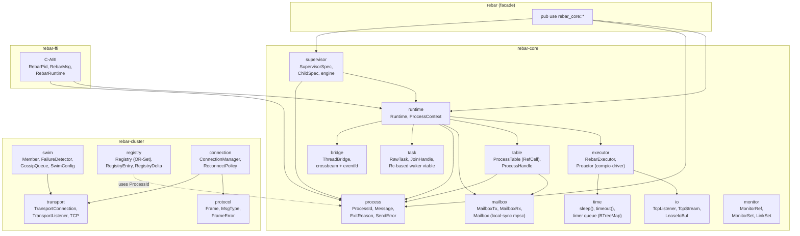

## 3. Process Model

Each process in Rebar is an independent asynchronous task running on the RebarExecutor. Processes are identified by a globally unique `ProcessId` consisting of a `(node_id: u64, thread_id: u64, local_id: u64)` triple. The `node_id` identifies which cluster node owns the process, `thread_id` identifies the OS thread within the node, and `local_id` is a monotonically incrementing counter allocated via `Cell<u64>` (thread-local, no atomics needed).

### Process Lifecycle

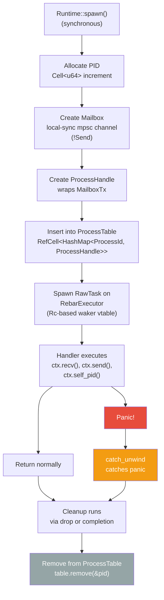

**Panic isolation** is a core design principle. Each process handler runs inside a `catch_unwind` boundary. If the handler panics, the panic is caught and the process is cleaned up (removed from the table) without affecting other processes or the executor. Tasks use an Rc-based waker vtable with `JoinHandle` supporting drop-cancellation and `detach()`. This means a single misbehaving process can never crash the runtime or affect other processes.

**ProcessContext** is the handle each process receives, providing three capabilities:
- `self_pid()` -- returns the process's own `ProcessId`
- `recv()` / `recv_timeout(duration)` -- receives messages from the mailbox
- `send(dest, payload)` -- sends a message to another process by PID

## 4. Message Flow

Messages in Rebar are structs containing a sender `ProcessId`, a `rmpv::Value` payload (MessagePack dynamic value), and a millisecond-precision timestamp. The use of `rmpv::Value` allows messages to carry arbitrary structured data -- strings, integers, maps, arrays, binary blobs -- without requiring a fixed schema.

### Local Messaging

Local messaging uses the thread-local `ProcessTable` (`RefCell<HashMap>`) and `local-sync` mpsc channels, which are `!Send`. All local message passing stays on a single OS thread with zero atomic operations.

```mermaid
sequenceDiagram
    participant Sender as Sender Process
    participant Table as ProcessTable<br>(RefCell&lt;HashMap&gt;)
    participant TX as MailboxTx<br>(local-sync mpsc sender)
    participant RX as MailboxRx<br>(local-sync mpsc receiver)
    participant Handler as Receiver Process

    Sender->>Table: table.send(dest_pid, msg)
    Table->>Table: processes.borrow().get(&pid)
    alt PID found
        Table->>TX: handle.send(msg)
        TX->>RX: channel delivery<br>(!Send, thread-local)
        RX->>Handler: ctx.recv().await
    else PID not found
        Table-->>Sender: Err(SendError::ProcessDead)
    end
```

### Cross-Thread Messaging

When a process sends to a PID on a different thread (same node), the message is routed through the `ThreadBridge` -- crossbeam channels with eventfd (Linux) or self-pipe (non-Linux) for waking the target thread's executor.

### Remote Messaging

When a process sends to a PID on a different node, the `MessageRouter` trait intercepts the call and routes it over the network. The `DistributedRouter` (from `rebar-cluster`) implements this trait: it delivers locally when `to.node_id() == self.node_id`, otherwise encodes the message as a `Frame` and sends a `RouterCommand::Send` to the transport layer via an mpsc channel.

On the receiving node, `deliver_inbound_frame()` extracts addressing from the frame header and delivers the payload to the target process's mailbox.

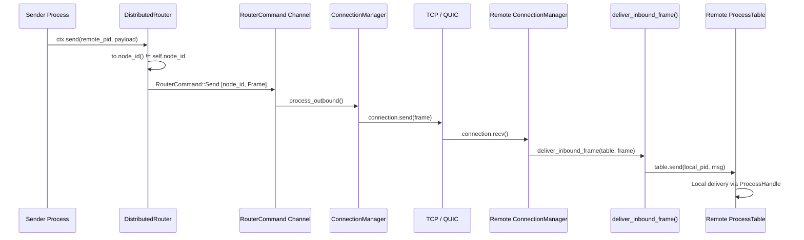

Key types:
- **`MessageRouter`** trait (rebar-core) — `route(from, to, payload) -> Result<(), SendError>`
- **`LocalRouter`** — default, wraps ProcessTable for single-node use
- **`DistributedRouter`** — local + remote routing via RouterCommand channel
- **`DistributedRuntime`** (rebar facade) — wires core Runtime with cluster ConnectionManager

See [Distribution Layer Internals](internals/distribution-layer.md) for the full deep dive.

## 5. Supervisor Trees

Rebar implements OTP-style supervision trees. A supervisor manages a set of child processes, monitoring them and applying a restart strategy when they fail. Supervisors themselves can be children of other supervisors, forming hierarchical fault-tolerance trees.

### Supervisor with Children

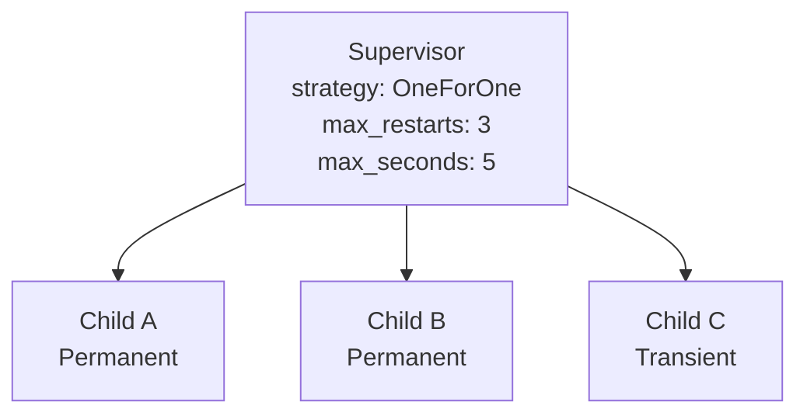

### Restart Strategies

When child B crashes, the supervisor's restart strategy determines which children are restarted:

**OneForOne** -- Only the crashed child restarts:

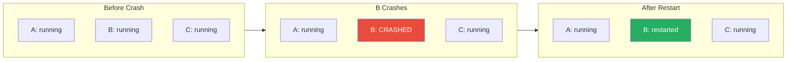

**OneForAll** -- All children restart:

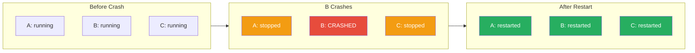

**RestForOne** -- The crashed child and all children started after it restart:

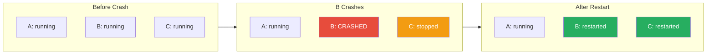

### Restart Limiting

The supervisor tracks restart timestamps in a `VecDeque<Instant>` sliding window. Each time a child is restarted, the current `Instant` is pushed onto the deque. Before restarting, the supervisor checks whether the number of restarts within the last `max_seconds` (default: 5) exceeds `max_restarts` (default: 3). If the limit is exceeded, the supervisor itself shuts down -- this prevents infinite restart loops from consuming resources and propagates the failure up the supervision tree.

**Restart types** determine whether a child should be restarted based on how it exited:
- **Permanent** -- always restart, regardless of exit reason
- **Transient** -- restart only on abnormal exit (panics, errors); normal exits are not restarted
- **Temporary** -- never restart, regardless of exit reason

**Shutdown strategies** control how a child is terminated during supervisor shutdown or restart-all scenarios:
- **Timeout(duration)** -- send a shutdown signal and wait up to `duration` for graceful exit (default: 5s)
- **BrutalKill** -- terminate the child immediately without waiting

## 6. SWIM Protocol

> **Note:** The SWIM protocol, wire protocol, CRDT registry, and connection management (sections 6-9) live in `rebar-cluster`, which still uses tokio internally for its transport layer. These sections describe the cluster architecture unchanged from its tokio-based implementation.

Rebar uses the SWIM (Scalable Weakly-consistent Infection-style process group Membership) protocol for cluster membership and failure detection. The implementation lives in the `rebar-cluster::swim` module.

### Node State Machine

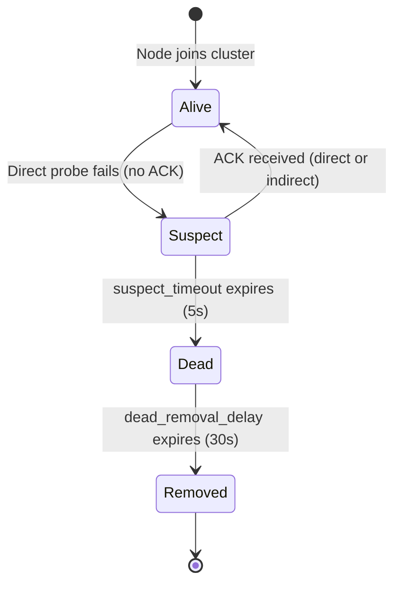

The `Member` struct also carries an optional `cert_hash: Option<[u8; 32]>` field — the SHA-256 fingerprint of the node's TLS certificate. When present, this enables automatic QUIC transport connections: a node receiving an `Alive` gossip with a `cert_hash` can connect to the advertised address and verify the certificate fingerprint without a CA.

### Protocol Mechanics

The SWIM protocol operates on a configurable tick cycle (default: 1 second `protocol_period`):

1. **Direct Probe**: Each tick, the `FailureDetector` selects a random alive or suspect member (excluding self) and sends a direct ping. If the target responds with an ACK, it remains (or returns to) Alive state.

2. **Indirect Probes**: If the direct probe fails (no ACK within the tick), the node is marked Suspect. The protocol then selects `indirect_probe_count` (default: 3) random alive members and asks them to probe the suspect node on its behalf. If any indirect probe receives an ACK, the suspect is cleared.

3. **Suspect Timeout**: A suspected node has `suspect_timeout` (default: 5 seconds) to prove it is alive. If no ACK arrives (directly or via indirect probes) within this window, the node is declared Dead.

4. **Dead Removal**: Dead nodes are kept in the membership list for `dead_removal_delay` (default: 30 seconds) to allow gossip to propagate the death notification. After the delay, they are permanently removed.

5. **Incarnation Numbers**: Each member maintains an `incarnation` counter. When a node is suspected, it can refute the suspicion by incrementing its incarnation number and broadcasting an Alive update with the higher incarnation. Stale suspicions (with lower incarnation than the node's current incarnation) are ignored.

6. **Gossip Piggybacking**: Membership state changes (Alive, Suspect, Dead, Leave) are queued in a `GossipQueue` and piggybacked on protocol messages, up to `max_gossip_per_tick` (default: 8) updates per tick. This provides epidemic-style dissemination of membership information without dedicated gossip rounds.

## 7. Wire Protocol

The wire protocol uses a fixed 18-byte header followed by variable-length MessagePack-encoded header and payload sections.

### Frame Layout

```
Offset  Size  Field
------  ----  -----
0       1     version (0x01)
1       1     msg_type (MsgType as u8)
2       8     request_id (u64 big-endian)
10      4     header_len (u32 big-endian)
14      4     payload_len (u32 big-endian)
18      N     header (MessagePack encoded)
18+N    M     payload (MessagePack encoded)
```

Total frame size: `18 + header_len + payload_len` bytes.

### Message Types

| Hex    | Variant          | Description                                          |
|--------|------------------|------------------------------------------------------|
| `0x01` | Send             | Deliver a message to a remote process                |
| `0x02` | Monitor          | Request monitoring of a remote process               |
| `0x03` | Demonitor        | Cancel a previously established monitor              |
| `0x04` | Link             | Establish a bidirectional link between processes      |
| `0x05` | Unlink           | Remove a bidirectional link                          |
| `0x06` | Exit             | Signal a process exit to linked/monitoring processes  |
| `0x07` | ProcessDown      | Notification that a monitored process has terminated  |
| `0x08` | NameLookup       | Query the global registry for a named process        |
| `0x09` | NameRegister     | Register a name in the global registry               |
| `0x0A` | NameUnregister   | Remove a name from the global registry               |
| `0x0B` | Heartbeat        | Periodic liveness check between connected nodes      |
| `0x0C` | HeartbeatAck     | Response to a Heartbeat                              |
| `0x0D` | NodeInfo         | Exchange node metadata during connection setup       |

Both the `header` and `payload` fields use `rmpv::Value` (MessagePack dynamic value), allowing flexible structured data without a rigid schema. The header typically carries routing metadata (source/destination PIDs, monitor refs), while the payload carries application data.

## 8. Global Registry (CRDT)

The global name registry uses an OR-Set (Observed-Remove Set) CRDT to provide eventually-consistent process name registration across all nodes in the cluster. Conflict resolution uses Last-Writer-Wins (LWW) semantics.

### Registry Operations

```mermaid
flowchart TD
    subgraph register["Register"]
        R1["Create RegistryEntry"] --> R2["Generate UUID v4 tag"]
        R2 --> R3["Record timestamp +<br>node_id"]
        R3 --> R4["Add to entries map"]
        R4 --> R5["Emit Add delta<br>for replication"]
    end

    subgraph lookup["Lookup"]
        L1["Collect all entries<br>for name"] --> L2["Pick highest timestamp"]
        L2 --> L3{"Timestamp tie?"}
        L3 -->|Yes| L4["Highest node_id wins<br>(deterministic tiebreak)"]
        L3 -->|No| L5["Return winner"]
        L4 --> L5
    end

    subgraph unregister["Unregister"]
        U1["Remove all entries<br>for name"] --> U2["Add each tag to<br>tombstone set"]
        U2 --> U3["Emit Remove deltas<br>(one per tag)"]
    end

    subgraph merge["Merge Remote Delta"]
        M1{"Delta type?"} -->|Add| M2{"Tag in<br>tombstones?"}
        M2 -->|Yes| M3["Reject:<br>prevents resurrection"]
        M2 -->|No| M4{"Tag already<br>present?"}
        M4 -->|Yes| M5["Skip:<br>idempotent"]
        M4 -->|No| M6["Add entry to map"]
        M1 -->|Remove| M7["Add tag to tombstones"]
        M7 --> M8["Remove entry from map"]
    end

    subgraph convergence["Convergence"]
        C1["Node A applies deltas"] --> C3["Same deltas +<br>commutative merge"]
        C2["Node B applies deltas"] --> C3
        C3 --> C4["Identical state on<br>all nodes"]
    end
```

### Convergence Properties

The OR-Set CRDT guarantees that when all deltas have been exchanged and applied, every node in the cluster will have identical registry state. Key properties:

- **Add-wins semantics**: A new registration with a fresh UUID tag is always accepted (unless that specific tag has been tombstoned).
- **Tombstone permanence**: Once a UUID tag is tombstoned, it can never be re-added. This prevents the "resurrection" problem where concurrent add and remove operations could cause a removed entry to reappear.
- **Idempotent merges**: Applying the same Add delta multiple times has no effect beyond the first application.
- **Commutativity**: Deltas can be applied in any order and produce the same result.

## 9. Connection Management

The `ConnectionManager` handles the lifecycle of connections to remote nodes, integrating with SWIM discovery and providing automatic reconnection with exponential backoff.

### Connection Lifecycle

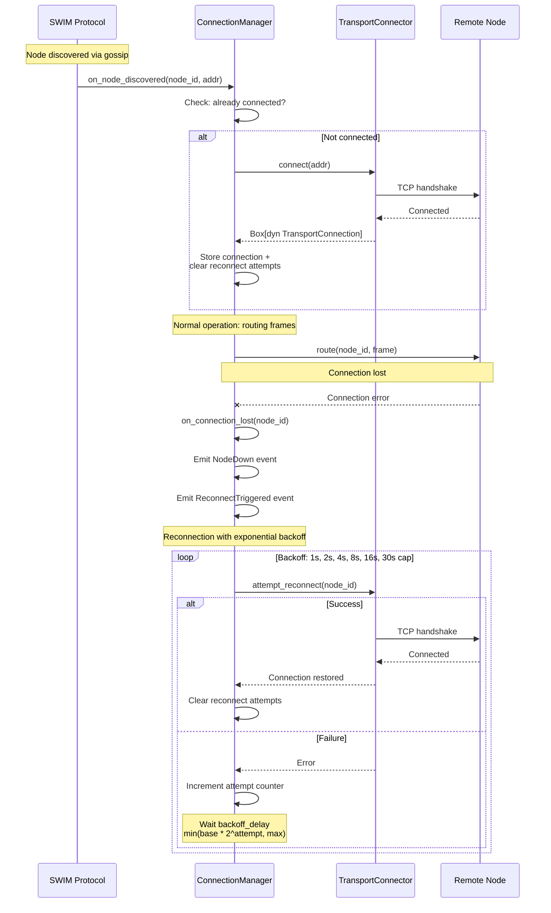

### Reconnection Policy

The `ReconnectPolicy` uses exponential backoff with the formula: `delay = min(base_delay * 2^attempt, max_delay)`.

| Attempt | Delay (default config) |
|---------|----------------------|
| 0       | 1s                   |
| 1       | 2s                   |
| 2       | 4s                   |
| 3       | 8s                   |
| 4       | 16s                  |
| 5+      | 30s (capped)         |

The `TransportConnector` trait abstracts the transport implementation, allowing the `ConnectionManager` to work with TCP, QUIC, or mock transports interchangeably.

### QUIC Transport

Rebar includes a QUIC transport implementation (`rebar-cluster::transport::quic`) built on [quinn](https://docs.rs/quinn) 0.11. Key design decisions:

- **Stream-per-frame model.** Each `send()` opens a new unidirectional QUIC stream, writes a 4-byte big-endian length prefix followed by the encoded frame, then finishes the stream. Each `recv()` accepts a unidirectional stream and reads the length-prefixed frame. This avoids head-of-line blocking between independent messages.
- **Self-signed certificates.** `generate_self_signed_cert()` uses [rcgen](https://docs.rs/rcgen) to produce a DER certificate, PKCS8 private key, and SHA-256 fingerprint (`CertHash = [u8; 32]`).
- **Fingerprint verification.** `FingerprintVerifier` implements `rustls::client::danger::ServerCertVerifier` to verify the remote certificate's SHA-256 hash matches the expected value. No CA trust chain is needed.
- **SWIM integration.** The `cert_hash` field on `Member` and `GossipUpdate::Alive` allows nodes to exchange certificate fingerprints via gossip, enabling automatic QUIC connection establishment.

See [QUIC Transport Internals](internals/quic-transport.md) for implementation details.

### Graceful Node Drain

The drain protocol (`rebar-cluster::drain`) provides orderly node shutdown in three phases:

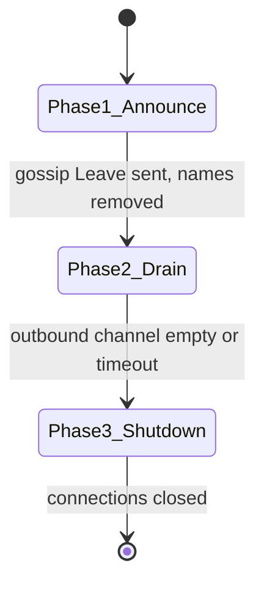

| Phase | Action | Timeout (default) |
|-------|--------|-------------------|
| 1. Announce | Broadcast `GossipUpdate::Leave`, unregister all names from registry | 5s |
| 2. Drain Outbound | Process remaining `RouterCommand`s from channel | 30s |
| 3. Shutdown | Close all connections via `ConnectionManager::drain_connections()` | 10s |

`DrainResult` provides observability: `processes_stopped`, `messages_drained`, `phase_durations`, and `timed_out`.

See [Node Drain Internals](internals/node-drain.md) for the full protocol specification.

## 10. FFI Layer

The `rebar-ffi` crate provides a C-ABI interface that enables embedding the Rebar runtime in any language with C FFI support. It exposes opaque handle types and a set of `extern "C"` functions following Rust's `#[unsafe(no_mangle)]` convention.

> **Note:** `rebar-ffi` wraps the core runtime with a tokio bridge for FFI compatibility. The internal `RebarRuntime` struct still creates a `tokio::runtime::Runtime` to drive async operations from synchronous FFI calls. Migrating to expose `RebarExecutor` directly is a future goal.

### FFI Architecture

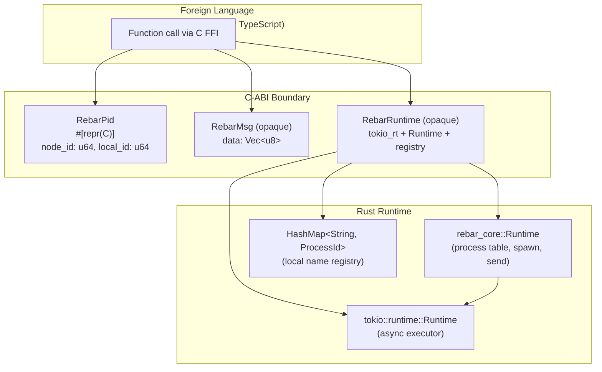

### Memory Ownership Model

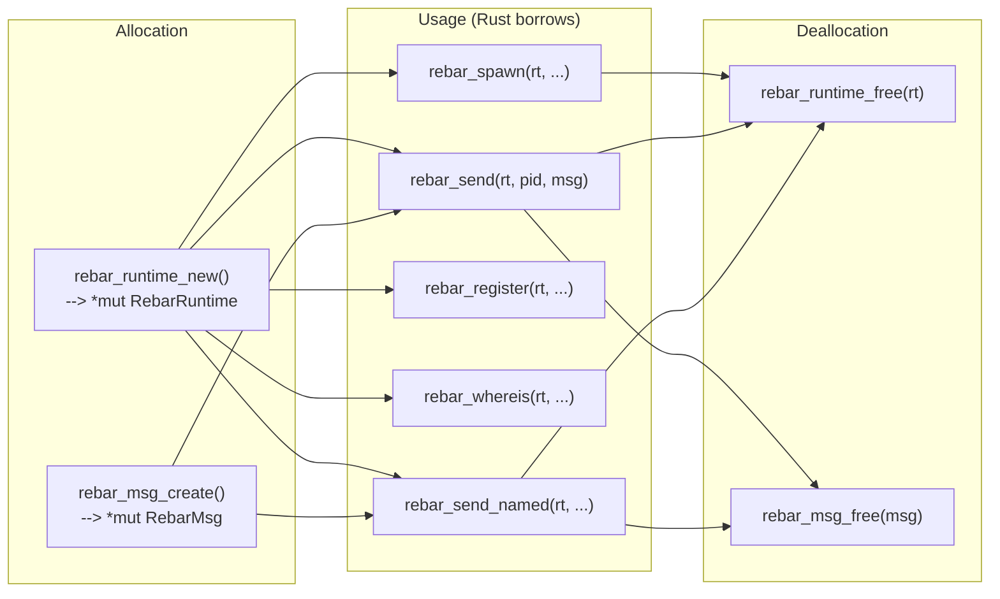

### Error Codes

| Code | Constant              | Meaning                                    |
|------|-----------------------|--------------------------------------------|
| 0    | `REBAR_OK`            | Operation succeeded                        |
| -1   | `REBAR_ERR_NULL_PTR`  | A required pointer argument was null       |
| -2   | `REBAR_ERR_SEND_FAILED` | Message send failed (process dead or mailbox full) |
| -3   | `REBAR_ERR_NOT_FOUND` | Named process not found in registry        |
| -4   | `REBAR_ERR_INVALID_NAME` | Name bytes are not valid UTF-8          |

### FFI Functions

| Function             | Signature                                                              | Purpose                              |
|----------------------|------------------------------------------------------------------------|--------------------------------------|
| `rebar_runtime_new`  | `(node_id: u64) -> *mut RebarRuntime`                                 | Create a new runtime                 |
| `rebar_runtime_free` | `(rt: *mut RebarRuntime)`                                             | Free a runtime                       |
| `rebar_msg_create`   | `(data: *const u8, len: usize) -> *mut RebarMsg`                     | Create a message from raw bytes      |
| `rebar_msg_data`     | `(msg: *const RebarMsg) -> *const u8`                                 | Get pointer to message data          |
| `rebar_msg_len`      | `(msg: *const RebarMsg) -> usize`                                     | Get message data length              |
| `rebar_msg_free`     | `(msg: *mut RebarMsg)`                                                | Free a message                       |
| `rebar_spawn`        | `(rt, callback: extern "C" fn(RebarPid), pid_out) -> i32`            | Spawn a process                      |
| `rebar_send`         | `(rt, dest: RebarPid, msg) -> i32`                                    | Send message by PID                  |
| `rebar_register`     | `(rt, name: *const u8, name_len, pid: RebarPid) -> i32`              | Register a name                      |
| `rebar_whereis`      | `(rt, name: *const u8, name_len, pid_out) -> i32`                    | Look up a name                       |
| `rebar_send_named`   | `(rt, name: *const u8, name_len, msg) -> i32`                        | Send message by name                 |

All pointer-accepting functions perform null checks and return `REBAR_ERR_NULL_PTR` for null arguments. Passing null to `_free` functions is a safe no-op, following the convention of C's `free()`.

---

## See Also

- **API Reference:** [rebar-core](api/rebar-core.md) | [rebar-cluster](api/rebar-cluster.md) | [rebar-ffi](api/rebar-ffi.md)
- **Deep Dives:** [Supervisor Engine Internals](internals/supervisor-engine.md) | [Wire Protocol Internals](internals/wire-protocol.md) | [SWIM Protocol Internals](internals/swim-protocol.md) | [CRDT Registry Internals](internals/crdt-registry.md) | [QUIC Transport](internals/quic-transport.md) | [Distribution Layer](internals/distribution-layer.md) | [Node Drain](internals/node-drain.md)
- **Guides:** [Getting Started](getting-started.md) | [Extending Rebar](extending.md)
- **Performance:** [Benchmarks](benchmarks.md)
