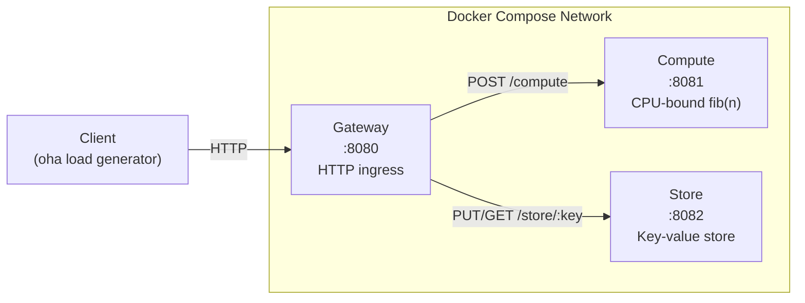
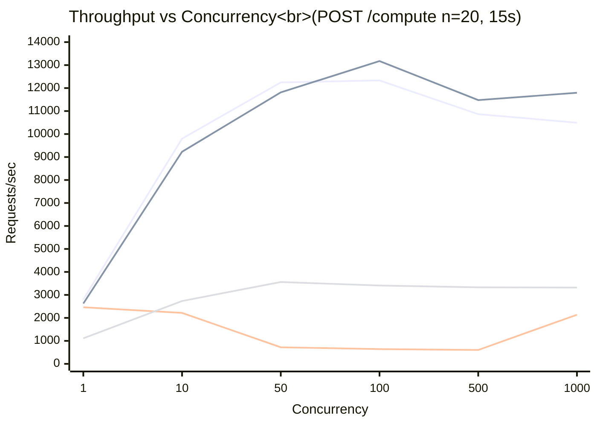

# Benchmarks

## Overview

This document presents benchmark results comparing Rebar against three established stacks -- Actix (Rust), Go (stdlib), and Elixir (OTP) -- in an HTTP microservices mesh scenario. The goal is to measure how each runtime handles concurrent request processing, process/goroutine/task spawning, and inter-service communication under varying load conditions.

All benchmarks use identical application logic across stacks: a three-service mesh that exercises request routing, CPU-bound computation with per-request isolation, and stateful key-value storage with per-key concurrency.

## Test Application Architecture

Each stack implements the same three-service mesh:



**Gateway (port 8080)** -- HTTP ingress that accepts client requests and routes them to the appropriate backend service. Handles `POST /compute` by proxying to Compute and `PUT/GET /store/:key` by proxying to Store.

**Compute (port 8081)** -- CPU-bound fibonacci computation. Each request spawns an isolated unit of work to compute `fib(n)` and return the result. Tests process creation overhead and computational throughput.

**Store (port 8082)** -- Stateful key-value store. Each unique key gets its own isolated process/goroutine/task that persists for the lifetime of the service. Tests long-lived process management and concurrent state access.

### Stack Implementations

| Component | Rebar | Actix | Go | Elixir |
|---|---|---|---|---|
| HTTP server | axum | actix-web | net/http (stdlib) | Plug + Cowboy |
| Compute isolation | `Runtime::spawn` per request | `tokio::task::spawn_blocking` | goroutine per request | `Task.Supervisor.async` |
| Store isolation | `Runtime::spawn` per key | `tokio::task::spawn_blocking` | goroutine per key | `Agent` per key |
| Supervision | rebar-core supervisor tree | -- | -- | `Task.Supervisor` |

## Infrastructure

All benchmarks run inside Docker Compose on a shared bridge network with identical resource constraints per container:

- **CPU:** 2 cores per container
- **Memory:** 512MB per container
- **Health checks:** curl-based, 2-second interval
- **Docker version:** 20.10+
- **Load generator:** [oha](https://github.com/hatoo/oha) (Rust HTTP benchmarking tool), running on the host outside the Docker network

Container images are built from optimized production Dockerfiles for each stack (multi-stage builds, release mode for Rust, static linking for Go, release compilation for Elixir).

## Scenarios

### 1. Throughput Ramp

**Endpoint:** `POST /compute` with `n=20`
**Concurrency levels:** 1, 10, 50, 100, 500, 1000
**Duration:** 15 seconds per level

Measures how throughput scales as concurrent connections increase. The `n=20` fibonacci computation is light enough that the bottleneck shifts from computation to scheduling and I/O handling at higher concurrency.

### 2. Latency Profile

**Endpoint:** `POST /compute` with `n=30`
**Concurrency:** 100
**Duration:** 30 seconds

Sustained load with a heavier computation (`n=30`) to measure the full percentile distribution. The higher computation cost amplifies differences in scheduling fairness and tail latency.

### 3. Process Spawn Stress

**Endpoint:** `PUT /store/key`
**Concurrency:** 50
**Total requests:** 10,000

Each request creates a new key, forcing the store service to spawn a new process/goroutine/agent. Measures raw process creation overhead and the cost of maintaining many concurrent lightweight processes.

### 4. Cross-Node Messaging

**Endpoint:** `POST /compute` with `n=10`
**Concurrency:** 100
**Duration:** 30 seconds

Light computation (`n=10`) so the dominant cost is HTTP routing: client to Gateway to Compute and back. Isolates inter-service communication latency from computation overhead.

## Results

### Throughput Ramp (requests/sec)



| Concurrency | Rebar | Actix | Go | Elixir |
|---|---|---|---|---|
| c=1 | 2,799 | 2,625 | 2,464 | 1,112 |
| c=10 | 9,800 | 9,230 | 2,216 | 2,734 |
| c=50 | 12,247 | 11,812 | 721 | 3,560 |
| c=100 | 12,332 | 13,175 | 642 | 3,410 |
| c=500 | 10,864 | 11,478 | 604 | 3,330 |
| c=1000 | 10,495 | 11,795 | 2,138 | 3,320 |

### Latency Profile (c=100, POST /compute n=30, 30s)

| Metric | Rebar | Actix | Go | Elixir |
|---|---|---|---|---|
| req/s | 11,477 | 10,794 | 993 | 3,405 |
| P50 | 8.44ms | 9.02ms | 54.98ms | 28.78ms |
| P95 | 13.48ms | 14.45ms | 332ms | 40.05ms |
| P99 | 16.95ms | 17.71ms | 866ms | 47.28ms |
| P99.9 | 22.17ms | 22.94ms | 1300ms | 59.43ms |

### Cross-Node Messaging (c=100, POST /compute n=10, 30s)

| Metric | Rebar | Actix | Go | Elixir |
|---|---|---|---|---|
| req/s | 11,515 | 10,865 | 1,262 | 3,420 |
| P50 | 8.42ms | 8.95ms | 20.44ms | 28.61ms |
| P99 | 16.67ms | 18.12ms | 1103ms | 46.83ms |

### Process Spawn Stress (c=50, PUT /store/key, 10k requests)

| Metric | Rebar | Actix | Go | Elixir |
|---|---|---|---|---|
| req/s | 11,551 | 12,664 | 5,025 | 3,735 |
| P50 | 4.01ms | 3.61ms | 8.30ms | 13.10ms |
| P99 | 11.68ms | 9.89ms | 31.92ms | 25.00ms |

## Analysis

### Rebar vs Actix

Rebar and Actix deliver near-identical performance across all scenarios, which is expected since both compile to native code on the same foundation (Rust + tokio async runtime). The key finding is that Rebar's actor model adds minimal overhead compared to raw async task spawning:

- **Throughput:** Within 5-10% of each other at every concurrency level. Actix edges ahead at c=100+ in the throughput ramp, likely due to less per-request bookkeeping (no mailbox allocation, no process table insertion).
- **Latency:** Rebar consistently shows slightly lower P50 and P99 latency (0.5-1ms difference), suggesting the structured process model may improve scheduling fairness under load.
- **Spawn stress:** Actix is ~10% faster at raw spawning (12,664 vs 11,551 req/s), reflecting the overhead of Rebar's process table registration and mailbox setup. This is the cost of getting supervision, monitoring, and named processes.

The practical takeaway: choosing Rebar over raw async Rust costs less than 10% throughput in exchange for the full actor model (supervision, monitoring, message passing, linking).

### Rebar vs Go

Rebar shows a 10-20x throughput advantage at high concurrency:

- **Low concurrency (c=1):** Go is competitive at 2,464 req/s vs Rebar's 2,799. Single-request latency is comparable because there is no contention.
- **High concurrency (c=50+):** Go collapses to ~640 req/s. The goroutine-per-request model with synchronous HTTP proxying creates heavy contention under load. Go's runtime scheduler struggles when thousands of goroutines are blocked on HTTP round-trips.
- **Tail latency:** Go's P99 reaches 866ms and P99.9 hits 1.3 seconds at c=100, compared to Rebar's 17ms and 22ms respectively. The synchronous proxy model creates head-of-line blocking.
- **Recovery at c=1000:** Go partially recovers to 2,138 req/s, likely due to the Go runtime's adaptive scheduling kicking in at extreme concurrency.

The Go implementation uses idiomatic stdlib patterns (`net/http` + goroutines). A Go implementation using an async HTTP client or connection pooling would likely perform significantly better. These results reflect the default goroutine-per-request approach, not Go's theoretical ceiling.

### Rebar vs Elixir

Rebar delivers roughly 3x the throughput and 3x lower latency compared to Elixir:

- **Throughput:** Rebar sustains 10,000-12,000 req/s where Elixir plateaus at 3,300-3,500. The BEAM VM's interpretation overhead and garbage collection pauses account for much of this gap.
- **Latency consistency:** Elixir's P99/P99.9 spread is notably tight (28ms P50 to 59ms P99.9 -- roughly a 2x ratio). Rebar's spread is similar in ratio (8ms to 22ms) but at a lower absolute level.
- **Concurrency scaling:** Elixir shows remarkably flat throughput from c=50 through c=1000 (3,300-3,560 req/s). The BEAM scheduler maintains consistent performance regardless of concurrency level, which is one of Erlang/OTP's core design strengths.
- **Spawn stress:** The widest gap appears in process spawning where Rebar achieves 3x Elixir's throughput. Rebar processes are stack-allocated futures on tokio's work-stealing scheduler, while BEAM processes carry their own heap and reduction counter.

Elixir's strength is operational stability under unpredictable load. The BEAM's preemptive scheduler guarantees fairness even for pathological workloads. Rebar inherits tokio's cooperative scheduling model, which delivers better raw performance but relies on well-behaved tasks yielding regularly.

### What This Benchmark Measures

- HTTP request routing through a multi-service mesh
- Process, goroutine, and task spawning overhead
- Inter-service HTTP communication latency
- Throughput scaling from single-connection to high concurrency

### What This Benchmark Does Not Measure

- **Distribution and clustering overhead** -- all services communicate over a shared Docker bridge network with negligible latency. Real deployments across data centers would show different characteristics.
- **Long-running actor state management** -- the store service creates processes but the benchmark does not exercise sustained state mutation over time.
- **Hot code reloading** -- a core BEAM/OTP feature with no equivalent in Rebar or Go.
- **Fault tolerance under load** -- supervisor restart rates, cascading failure handling, and back-pressure during process crashes are not tested.

## Reproducing

Prerequisites:

```bash
docker --version  # 20.10+
oha --version     # 1.0+
```

Run all benchmarks:

```bash
./bench/harness/run.sh all
```

Run individual stacks:

```bash
./bench/harness/run.sh rebar
./bench/harness/run.sh actix
./bench/harness/run.sh go
./bench/harness/run.sh elixir
```

Results are saved to `bench/results/` with a summary report at `bench/results/report.md`.

---

## See Also

- [Architecture](architecture.md) -- for understanding Rebar's crate structure and process model
- [Getting Started](getting-started.md) -- for running your own Rebar applications
- [rebar-core API Reference](api/rebar-core.md) -- for the Runtime, ProcessContext, and supervisor APIs used in the benchmark services
