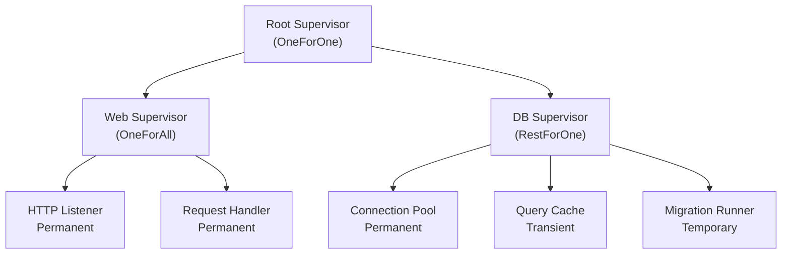
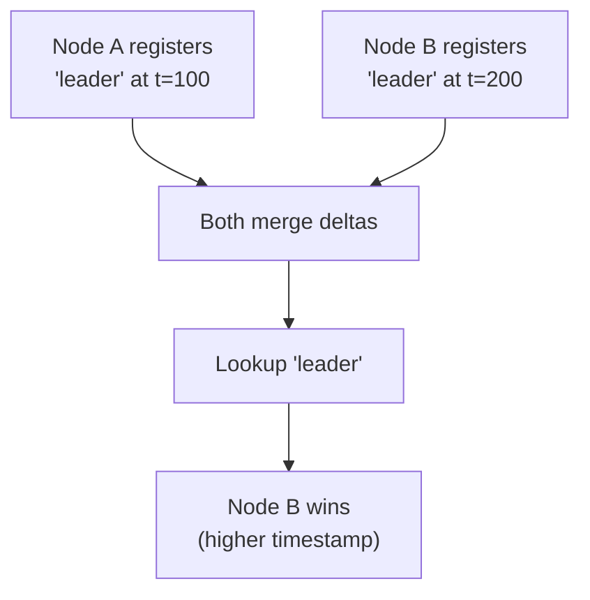

# Extending Rebar

Rebar is designed to be extended. The runtime's layered crate architecture exposes clean interfaces at each boundary, making it straightforward to plug in custom behavior without modifying upstream code. This guide covers the primary extension points: custom transports, supervisor strategies, FFI bindings, and message serialization.

## Table of Contents

1. [Custom Transport Implementation](#1-custom-transport-implementation)
2. [Custom Supervisor Strategies](#2-custom-supervisor-strategies)
3. [FFI Bindings for New Languages](#3-ffi-bindings-for-new-languages)
4. [Custom Message Serialization](#4-custom-message-serialization)
5. [Custom Registry Backends](#5-custom-registry-backends)

---

## 1. Custom Transport Implementation

Rebar's networking is pluggable via two async traits in `rebar-cluster`. The built-in TCP transport is one implementation, but you can swap in QUIC, Unix sockets, WebSockets, or anything else that can frame bytes.

### The Core Traits

Every transport must implement `TransportConnection` for individual connections and `TransportListener` for accepting inbound connections:

```rust
use std::net::SocketAddr;
use async_trait::async_trait;
use rebar_cluster::protocol::Frame;
use rebar_cluster::transport::TransportError;

#[async_trait]
pub trait TransportConnection: Send + Sync {
    async fn send(&mut self, frame: &Frame) -> Result<(), TransportError>;
    async fn recv(&mut self) -> Result<Frame, TransportError>;
    async fn close(&mut self) -> Result<(), TransportError>;
}

#[async_trait]
pub trait TransportListener: Send + Sync {
    type Connection: TransportConnection;
    fn local_addr(&self) -> SocketAddr;
    async fn accept(&self) -> Result<Self::Connection, TransportError>;
}
```

Key design points:

- **Frame encapsulates all wire protocol messages.** A `Frame` contains a version byte, a `MsgType` discriminant (Send, Monitor, Link, Heartbeat, etc.), a request ID, and header/payload fields encoded as `rmpv::Value`. Your transport does not need to understand message semantics -- it only shuttles raw frames.
- **Transport only handles raw frame send/recv.** Serialization, routing, and protocol logic all live above the transport layer. Your implementation just needs to get bytes from point A to point B reliably.
- **No need to understand message semantics.** The `Frame::encode()` and `Frame::decode()` methods handle the binary format. Your transport calls `frame.encode()` to get bytes for the wire and `Frame::decode(&bytes)` to reconstruct frames on the other side.

### Wire Format Reference

The built-in TCP transport uses length-prefixed framing:

```text
+----------+--------------+
| len: u32 | payload: [u8]|
+----------+--------------+
```

Where `payload` is the output of `Frame::encode()`:

```text
+----------+----------+------------+------------+--------+---------+
| ver: u8  | type: u8 | req_id: u64| hdr_len: u32| pay_len: u32 | header | payload |
+----------+----------+------------+-------------+--------+---------+
```

You are free to use a different framing scheme for your transport (e.g., QUIC's native stream framing), as long as complete frames are delivered to `Frame::decode()`.

### Example: QUIC Transport (Built-in)

Rebar ships with a QUIC transport in `rebar_cluster::transport::quic`. It demonstrates the stream-per-frame pattern:

```rust
use rebar_cluster::transport::quic::{QuicTransport, generate_self_signed_cert, QuicTransportConnector};

// Generate credentials
let (cert, key, hash) = generate_self_signed_cert();

// Server: bind and listen
let transport = QuicTransport::new(cert.clone(), key.clone_key());
let listener = transport.listen("0.0.0.0:4001".parse().unwrap()).await?;

// Client: connect with fingerprint verification
let conn = transport.connect(remote_addr, expected_cert_hash).await?;

// ConnectionManager integration
let connector = QuicTransportConnector::new(cert, key, expected_cert_hash);
let mut mgr = ConnectionManager::new(Box::new(connector));
```

Key implementation patterns to follow if building a custom transport:
- **Stream-per-frame:** QUIC opens a new unidirectional stream per `send()`, avoiding head-of-line blocking
- **Length-prefixed framing:** 4-byte big-endian length prefix before encoded frame bytes
- **Certificate verification:** Custom `rustls::client::danger::ServerCertVerifier` for fingerprint-based auth

See [QUIC Transport Internals](internals/quic-transport.md) for the full implementation walkthrough.

### Mock Transport for Testing

When writing tests for components that use transports, you can implement a mock connector. Here is the pattern used in Rebar's own connection manager tests:

```rust
use std::sync::{Arc, Mutex};
use async_trait::async_trait;
use rebar_cluster::protocol::Frame;
use rebar_cluster::transport::{TransportConnection, TransportError};
use rebar_cluster::connection::TransportConnector;

/// Records all frames sent through this connection.
struct MockConnection {
    sent: Arc<Mutex<Vec<Vec<u8>>>>,
    closed: Arc<Mutex<bool>>,
}

impl MockConnection {
    fn new(sent: Arc<Mutex<Vec<Vec<u8>>>>) -> Self {
        Self {
            sent,
            closed: Arc::new(Mutex::new(false)),
        }
    }
}

#[async_trait]
impl TransportConnection for MockConnection {
    async fn send(&mut self, frame: &Frame) -> Result<(), TransportError> {
        self.sent.lock().unwrap().push(frame.encode());
        Ok(())
    }

    async fn recv(&mut self) -> Result<Frame, TransportError> {
        Err(TransportError::ConnectionClosed)
    }

    async fn close(&mut self) -> Result<(), TransportError> {
        *self.closed.lock().unwrap() = true;
        Ok(())
    }
}

/// Controls whether connect succeeds or fails, and tracks sent data.
struct MockConnector {
    should_fail: Arc<Mutex<bool>>,
    sent_data: Arc<Mutex<Vec<Vec<u8>>>>,
    connect_count: Arc<Mutex<u32>>,
}

#[async_trait]
impl TransportConnector for MockConnector {
    async fn connect(
        &self,
        _addr: SocketAddr,
    ) -> Result<Box<dyn TransportConnection>, TransportError> {
        *self.connect_count.lock().unwrap() += 1;
        if *self.should_fail.lock().unwrap() {
            return Err(TransportError::Io(std::io::Error::new(
                std::io::ErrorKind::ConnectionRefused,
                "mock connection refused",
            )));
        }
        Ok(Box::new(MockConnection::new(self.sent_data.clone())))
    }
}
```

This pattern gives you full control over connection behavior in tests: you can verify what frames were sent, simulate connection failures, and count connection attempts.

## Customizing the Drain Protocol

The `NodeDrain` struct orchestrates graceful shutdown. You can customize timeouts via `DrainConfig`:

```rust
use rebar_cluster::drain::{NodeDrain, DrainConfig};
use std::time::Duration;

// Aggressive drain for dev/test
let config = DrainConfig {
    announce_timeout: Duration::from_secs(1),
    drain_timeout: Duration::from_secs(5),
    shutdown_timeout: Duration::from_secs(2),
};
let drain = NodeDrain::new(config);

// Or use individual phases for custom orchestration
let names_removed = drain.announce(node_id, addr, &mut gossip, &mut registry);
let (drained, timed_out) = drain.drain_outbound(&mut remote_rx, &mut mgr).await;
```

The three phases can be run individually if you need custom logic between them (e.g., waiting for a load balancer to deregister the node before draining).

See [Node Drain Internals](internals/node-drain.md) for protocol details.

---

## 2. Custom Supervisor Strategies

Rebar's supervisor system mirrors OTP's approach: a supervisor manages a set of child processes, restarting them according to configurable policies when they exit.

### Core Types

```rust
/// A factory that creates the child's async task. Must be callable multiple
/// times (for restarts) and is shared via Arc.
pub type ChildFactory = Arc<
    dyn Fn() -> Pin<Box<dyn Future<Output = ExitReason> + Send>> + Send + Sync,
>;

/// Pairs a ChildSpec with its ChildFactory for supervisor startup.
pub struct ChildEntry {
    pub spec: ChildSpec,
    pub factory: ChildFactory,
}

impl ChildEntry {
    pub fn new<F, Fut>(spec: ChildSpec, factory: F) -> Self
    where
        F: Fn() -> Fut + Send + Sync + 'static,
        Fut: Future<Output = ExitReason> + Send + 'static,
    { ... }
}
```

The `ChildSpec` configures restart behavior:

```rust
pub struct ChildSpec {
    pub id: String,
    pub restart: RestartType,    // Permanent | Transient | Temporary
    pub shutdown: ShutdownStrategy, // Timeout(Duration) | BrutalKill
}
```

And the supervisor itself is configured via `SupervisorSpec`:

```rust
pub struct SupervisorSpec {
    pub strategy: RestartStrategy, // OneForOne | OneForAll | RestForOne
    pub max_restarts: u32,         // default: 3
    pub max_seconds: u32,          // default: 5
    pub children: Vec<ChildSpec>,
}
```

The three restart strategies are:

- **OneForOne** -- only the crashed child is restarted
- **OneForAll** -- all children are restarted when one crashes
- **RestForOne** -- the crashed child and all children started after it are restarted

### Simple Worker Factory

The most basic case: a stateless worker that runs in a loop.

```rust
use std::sync::Arc;
use rebar_core::process::ExitReason;
use rebar_core::supervisor::spec::{ChildSpec, RestartType};
use rebar_core::supervisor::engine::ChildEntry;

let worker = ChildEntry::new(
    ChildSpec::new("ticker")
        .restart(RestartType::Permanent),
    || async {
        loop {
            tokio::time::sleep(std::time::Duration::from_secs(1)).await;
            println!("tick");
        }
        #[allow(unreachable_code)]
        ExitReason::Normal
    },
);
```

### Worker with Shared State

Use `Arc<Mutex<T>>` to share state across restarts. Since the factory is called each time the child restarts, the Arc is cloned into each invocation while the underlying state persists:

```rust
use std::sync::{Arc, Mutex};
use rebar_core::process::ExitReason;
use rebar_core::supervisor::spec::{ChildSpec, RestartType};
use rebar_core::supervisor::engine::ChildEntry;

let counter = Arc::new(Mutex::new(0u64));

let worker = ChildEntry::new(
    ChildSpec::new("counter_worker")
        .restart(RestartType::Permanent),
    {
        let counter = counter.clone();
        move || {
            let counter = counter.clone();
            async move {
                let mut val = counter.lock().unwrap();
                *val += 1;
                println!("Worker started, restart count: {}", *val);
                drop(val);

                // Do work...
                tokio::time::sleep(std::time::Duration::from_secs(60)).await;
                ExitReason::Normal
            }
        }
    },
);
```

### Worker Pool

Run N identical workers under one supervisor by generating multiple `ChildEntry` instances:

```rust
use std::sync::Arc;
use rebar_core::process::ExitReason;
use rebar_core::runtime::Runtime;
use rebar_core::supervisor::spec::*;
use rebar_core::supervisor::engine::*;

let runtime = Arc::new(Runtime::new(1));

let pool_size = 4;
let children: Vec<ChildEntry> = (0..pool_size)
    .map(|i| {
        ChildEntry::new(
            ChildSpec::new(format!("pool_worker_{}", i))
                .restart(RestartType::Permanent),
            move || async move {
                println!("Pool worker {} running", i);
                loop {
                    tokio::time::sleep(std::time::Duration::from_secs(10)).await;
                }
                #[allow(unreachable_code)]
                ExitReason::Normal
            },
        )
    })
    .collect();

let spec = SupervisorSpec::new(RestartStrategy::OneForOne)
    .max_restarts(10)
    .max_seconds(60);

let handle = start_supervisor(runtime.clone(), spec, children).await;
```

### Dynamic Children at Runtime

The `SupervisorHandle` returned by `start_supervisor` allows adding children to a running supervisor:

```rust
use rebar_core::process::ExitReason;
use rebar_core::supervisor::spec::*;
use rebar_core::supervisor::engine::*;

// `handle` is a SupervisorHandle from start_supervisor()
let new_child = ChildEntry::new(
    ChildSpec::new("dynamic_worker")
        .restart(RestartType::Transient),
    || async {
        println!("Dynamic worker started");
        tokio::time::sleep(std::time::Duration::from_secs(30)).await;
        ExitReason::Normal
    },
);

let child_pid = handle.add_child(new_child).await
    .expect("failed to add child");
println!("Dynamic child started with PID: {}", child_pid);
```

### Supervisor Health Monitoring

The `SupervisorHandle` exposes the supervisor's own PID, which you can use for health checks, logging, or building supervision hierarchies:

```rust
let handle = start_supervisor(runtime.clone(), spec, children).await;

// Get the supervisor's PID for monitoring
let sup_pid = handle.pid();
println!("Supervisor running at PID: {}", sup_pid);

// Graceful shutdown
handle.shutdown();
```

### Combining Strategies

You can nest supervisors to create complex supervision trees. Use `RestartType::Transient` for children that should only restart on abnormal exits, and `RestartType::Temporary` for one-shot tasks:



---

## 3. FFI Bindings for New Languages

The `rebar-ffi` crate exposes a C-ABI layer that any language with C FFI support can call. This section walks through wrapping Rebar from a new language.

### Step 1: Build the Shared Library

```bash
cargo build -p rebar-ffi --release
```

This produces `target/release/librebar_ffi.so` (Linux), `librebar_ffi.dylib` (macOS), or `rebar_ffi.dll` (Windows).

### Step 2: Understand the C Types

The FFI layer exposes three primary types:

| C Type | Description | Ownership |
|--------|-------------|-----------|
| `RebarPid` | Value type with `node_id: u64` and `local_id: u64` | Passed by value, no allocation |
| `RebarMsg` | Opaque pointer wrapping `Vec<u8>` | Caller creates, caller frees |
| `RebarRuntime` | Opaque pointer wrapping tokio + rebar runtime | Caller creates, caller frees |

### Step 3: Know the Functions

```c
// Runtime lifecycle
RebarRuntime* rebar_runtime_new(uint64_t node_id);
void           rebar_runtime_free(RebarRuntime* rt);

// Process spawning
int32_t rebar_spawn(RebarRuntime* rt,
                    void (*callback)(RebarPid),
                    RebarPid* pid_out);

// Message lifecycle
RebarMsg* rebar_msg_create(const uint8_t* data, size_t len);
const uint8_t* rebar_msg_data(const RebarMsg* msg);
size_t         rebar_msg_len(const RebarMsg* msg);
void           rebar_msg_free(RebarMsg* msg);

// Sending messages
int32_t rebar_send(RebarRuntime* rt, RebarPid dest, const RebarMsg* msg);
int32_t rebar_send_named(RebarRuntime* rt,
                         const uint8_t* name, size_t name_len,
                         const RebarMsg* msg);

// Name registry
int32_t rebar_register(RebarRuntime* rt,
                       const uint8_t* name, size_t name_len,
                       RebarPid pid);
int32_t rebar_whereis(RebarRuntime* rt,
                      const uint8_t* name, size_t name_len,
                      RebarPid* pid_out);
```

### Step 4: Handle Memory Ownership

The golden rule: **caller creates, caller frees.** Every `rebar_runtime_new` must have a matching `rebar_runtime_free`. Every `rebar_msg_create` must have a matching `rebar_msg_free`. Passing `NULL` to any `_free` function is a safe no-op.

### Step 5: Map Error Codes

All functions returning `int32_t` use these error codes:

| Code | Constant | Meaning |
|------|----------|---------|
| `0` | `REBAR_OK` | Success |
| `-1` | `REBAR_ERR_NULL_PTR` | A required pointer argument was null |
| `-2` | `REBAR_ERR_SEND_FAILED` | Message delivery failed (process dead) |
| `-3` | `REBAR_ERR_NOT_FOUND` | Named process not found in registry |
| `-4` | `REBAR_ERR_INVALID_NAME` | Name bytes are not valid UTF-8 |

Map these to your language's idiomatic error handling (exceptions, Result types, error objects, etc.).

### Example: Ruby FFI Wrapper

```ruby
require 'ffi'

module Rebar
  extend FFI::Library
  ffi_lib 'rebar_ffi'

  # --- Types ---

  class Pid < FFI::Struct
    layout :node_id, :uint64,
           :local_id, :uint64

    def to_s
      "<#{self[:node_id]}.#{self[:local_id]}>"
    end
  end

  # --- Error codes ---

  REBAR_OK              =  0
  REBAR_ERR_NULL_PTR    = -1
  REBAR_ERR_SEND_FAILED = -2
  REBAR_ERR_NOT_FOUND   = -3
  REBAR_ERR_INVALID_NAME = -4

  class RebarError < StandardError; end
  class NullPointerError < RebarError; end
  class SendFailedError < RebarError; end
  class NotFoundError < RebarError; end
  class InvalidNameError < RebarError; end

  def self.check_error!(code)
    case code
    when REBAR_OK then nil
    when REBAR_ERR_NULL_PTR then raise NullPointerError, "null pointer"
    when REBAR_ERR_SEND_FAILED then raise SendFailedError, "send failed"
    when REBAR_ERR_NOT_FOUND then raise NotFoundError, "not found"
    when REBAR_ERR_INVALID_NAME then raise InvalidNameError, "invalid name"
    else raise RebarError, "unknown error: #{code}"
    end
  end

  # --- FFI bindings ---

  attach_function :rebar_runtime_new,  [:uint64], :pointer
  attach_function :rebar_runtime_free, [:pointer], :void
  attach_function :rebar_msg_create,   [:pointer, :size_t], :pointer
  attach_function :rebar_msg_data,     [:pointer], :pointer
  attach_function :rebar_msg_len,      [:pointer], :size_t
  attach_function :rebar_msg_free,     [:pointer], :void
  attach_function :rebar_spawn,        [:pointer, :pointer, :pointer], :int32
  attach_function :rebar_send,         [:pointer, Pid.by_value, :pointer], :int32
  attach_function :rebar_register,     [:pointer, :pointer, :size_t, Pid.by_value], :int32
  attach_function :rebar_whereis,      [:pointer, :pointer, :size_t, :pointer], :int32
  attach_function :rebar_send_named,   [:pointer, :pointer, :size_t, :pointer], :int32

  # --- High-level wrapper ---

  class Runtime
    def initialize(node_id)
      @ptr = Rebar.rebar_runtime_new(node_id)
      raise RebarError, "failed to create runtime" if @ptr.null?
      ObjectSpace.define_finalizer(self, self.class.invoke_free(@ptr))
    end

    def self.invoke_free(ptr)
      proc { Rebar.rebar_runtime_free(ptr) }
    end

    def register(name, pid)
      name_bytes = name.encode('utf-8')
      buf = FFI::MemoryPointer.from_string(name_bytes)
      rc = Rebar.rebar_register(@ptr, buf, name_bytes.bytesize, pid)
      Rebar.check_error!(rc)
    end

    def whereis(name)
      name_bytes = name.encode('utf-8')
      buf = FFI::MemoryPointer.from_string(name_bytes)
      pid_out = Pid.new
      rc = Rebar.rebar_whereis(@ptr, buf, name_bytes.bytesize, pid_out)
      Rebar.check_error!(rc)
      pid_out
    end
  end
end
```

### Example: Python ctypes Skeleton

```python
import ctypes
from ctypes import c_uint64, c_int32, c_size_t, c_void_p, c_uint8, POINTER, Structure

class RebarPid(Structure):
    _fields_ = [("node_id", c_uint64), ("local_id", c_uint64)]

    def __repr__(self):
        return f"<{self.node_id}.{self.local_id}>"

lib = ctypes.CDLL("./target/release/librebar_ffi.so")

# Runtime
lib.rebar_runtime_new.restype = c_void_p
lib.rebar_runtime_new.argtypes = [c_uint64]
lib.rebar_runtime_free.restype = None
lib.rebar_runtime_free.argtypes = [c_void_p]

# Messages
lib.rebar_msg_create.restype = c_void_p
lib.rebar_msg_create.argtypes = [POINTER(c_uint8), c_size_t]
lib.rebar_msg_free.restype = None
lib.rebar_msg_free.argtypes = [c_void_p]

# Send
lib.rebar_send.restype = c_int32
lib.rebar_send.argtypes = [c_void_p, RebarPid, c_void_p]

# Usage
rt = lib.rebar_runtime_new(1)
data = b"hello"
msg = lib.rebar_msg_create(data, len(data))
# ... spawn, send, etc.
lib.rebar_msg_free(msg)
lib.rebar_runtime_free(rt)
```

---

## 4. Custom Message Serialization

Rebar uses `rmpv::Value` (MessagePack dynamic typing) as its universal message payload. This gives you schema-free messaging out of the box, but for production applications you often want typed messages with compile-time guarantees.

### Typed Messages with Serde

Use `serde` with `rmpv` to get the best of both worlds -- typed Rust structs that serialize to the same `rmpv::Value` format Rebar already uses:

```rust
use serde::{Serialize, Deserialize};
use rebar_core::process::ProcessId;

#[derive(Serialize, Deserialize, Debug)]
enum AppMessage {
    Ping { reply_to: (u64, u64) },  // ProcessId as tuple
    Pong,
    Data { key: String, value: Vec<u8> },
}

// Helper to convert ProcessId for serialization
fn pid_to_tuple(pid: ProcessId) -> (u64, u64) {
    (pid.node_id(), pid.local_id())
}

fn tuple_to_pid(t: (u64, u64)) -> ProcessId {
    ProcessId::new(t.0, t.1)
}
```

### Sending Typed Messages

```rust
use rebar_core::runtime::Runtime;

let runtime = Runtime::new(1);

let server = runtime.spawn(move |mut ctx| async move {
    while let Some(msg) = ctx.recv().await {
        let app_msg: AppMessage =
            rmpv::ext::from_value(msg.payload().clone()).unwrap();

        match app_msg {
            AppMessage::Ping { reply_to } => {
                let dest = tuple_to_pid(reply_to);
                let pong = rmpv::ext::to_value(&AppMessage::Pong).unwrap();
                ctx.send(dest, pong).await.unwrap();
            }
            AppMessage::Data { key, value } => {
                println!("Received data: key={}, {} bytes", key, value.len());
            }
            _ => {}
        }
    }
}).await;

// Send a typed message
let my_pid = ProcessId::new(1, 0); // sender PID
let msg = AppMessage::Ping {
    reply_to: pid_to_tuple(my_pid),
};
let value = rmpv::ext::to_value(&msg).unwrap();
runtime.send(server, value).await.unwrap();
```

### Pattern: Protocol Envelope

For multi-protocol systems, wrap your messages in an envelope that carries version and type information:

```rust
use serde::{Serialize, Deserialize};

#[derive(Serialize, Deserialize)]
struct Envelope {
    version: u8,
    #[serde(rename = "type")]
    msg_type: String,
    payload: rmpv::Value,
}

impl Envelope {
    fn wrap<T: Serialize>(version: u8, msg_type: &str, payload: &T) -> rmpv::Value {
        let inner = rmpv::ext::to_value(payload).unwrap();
        rmpv::ext::to_value(&Envelope {
            version,
            msg_type: msg_type.to_string(),
            payload: inner,
        }).unwrap()
    }

    fn unwrap(value: &rmpv::Value) -> Self {
        rmpv::ext::from_value(value.clone()).unwrap()
    }
}

// Usage
let msg = Envelope::wrap(1, "user.created", &UserCreatedEvent {
    user_id: 42,
    email: "user@example.com".to_string(),
});
runtime.send(dest, msg).await.unwrap();
```

### Performance Considerations

- **`rmpv::Value` is already MessagePack.** There is no double-encoding when messages cross node boundaries -- the cluster protocol frames use `rmpv::Value` natively in both header and payload fields.
- **Avoid large binary blobs in messages.** MessagePack handles binary data efficiently, but very large payloads will be copied through the mailbox channel. For bulk data transfer, consider sending a reference (file path, shared memory key) instead.
- **Deserialization is the hot path.** For high-throughput workers, consider deserializing lazily or using `rmpv::Value` methods directly (`as_str()`, `as_u64()`, etc.) instead of full serde deserialization.

---

## 5. Custom Registry Backends

Rebar's distributed name registry allows processes to be looked up by name across the cluster. The built-in implementation uses an OR-Set CRDT for conflict-free replication.

### Current Implementation

The `Registry` in `rebar-cluster` is an in-memory OR-Set CRDT with these core operations:

```rust
impl Registry {
    /// Register a name to a process. Returns the unique tag for this registration.
    pub fn register(&mut self, name: &str, pid: ProcessId, node_id: u64, timestamp: u64) -> Uuid;

    /// Look up the winning registration for a name (LWW with node_id tiebreaker).
    pub fn lookup(&self, name: &str) -> Option<&RegistryEntry>;

    /// Unregister a name. Tombstones all tags for this name.
    pub fn unregister(&mut self, name: &str) -> Option<Vec<RegistryDelta>>;

    /// Merge a remote delta into this registry.
    pub fn merge_delta(&mut self, delta: RegistryDelta);

    /// Generate deltas representing all current state, for full sync.
    pub fn generate_deltas(&self) -> Vec<RegistryDelta>;
}
```

The delta types drive replication:

```rust
pub enum RegistryDelta {
    Add(RegistryEntry),
    Remove { name: String, tag: Uuid },
}
```

### Conflict Resolution

The registry uses Last-Writer-Wins (LWW) conflict resolution:

1. Higher timestamp wins
2. If timestamps are equal, higher `node_id` wins (deterministic tiebreaker)
3. Tombstoned tags cannot be re-added, preventing resurrection after merge



### Building a Custom Backend

A custom registry backend could add capabilities like persistent storage, different conflict resolution strategies, or cache layers. To build one, you need to implement the same logical interface:

**1. Registration with tagging:**

```rust
use uuid::Uuid;
use rebar_core::process::ProcessId;

pub struct PersistentRegistry {
    db: sqlx::SqlitePool,
}

impl PersistentRegistry {
    pub async fn register(
        &self,
        name: &str,
        pid: ProcessId,
        node_id: u64,
        timestamp: u64,
    ) -> Uuid {
        let tag = Uuid::new_v4();
        sqlx::query(
            "INSERT INTO registry (name, node_id, local_id, tag, timestamp, origin_node)
             VALUES (?, ?, ?, ?, ?, ?)"
        )
        .bind(name)
        .bind(pid.node_id() as i64)
        .bind(pid.local_id() as i64)
        .bind(tag.to_string())
        .bind(timestamp as i64)
        .bind(node_id as i64)
        .execute(&self.db)
        .await
        .unwrap();
        tag
    }

    pub async fn lookup(&self, name: &str) -> Option<RegistryEntry> {
        // LWW: ORDER BY timestamp DESC, node_id DESC
        sqlx::query_as(
            "SELECT * FROM registry
             WHERE name = ? AND tag NOT IN (SELECT tag FROM tombstones)
             ORDER BY timestamp DESC, origin_node DESC
             LIMIT 1"
        )
        .bind(name)
        .fetch_optional(&self.db)
        .await
        .unwrap()
    }
}
```

**2. Delta generation and merging** -- same semantics as the in-memory version, but persisted:

```rust
impl PersistentRegistry {
    pub async fn merge_delta(&self, delta: RegistryDelta) {
        match delta {
            RegistryDelta::Add(entry) => {
                // Check tombstones before inserting
                let tombstoned = sqlx::query_scalar::<_, bool>(
                    "SELECT EXISTS(SELECT 1 FROM tombstones WHERE tag = ?)"
                )
                .bind(entry.tag.to_string())
                .fetch_one(&self.db)
                .await
                .unwrap();

                if !tombstoned {
                    // Idempotent insert
                    sqlx::query(
                        "INSERT OR IGNORE INTO registry (...) VALUES (...)"
                    )
                    .execute(&self.db)
                    .await
                    .unwrap();
                }
            }
            RegistryDelta::Remove { name: _, tag } => {
                sqlx::query("INSERT OR IGNORE INTO tombstones (tag) VALUES (?)")
                    .bind(tag.to_string())
                    .execute(&self.db)
                    .await
                    .unwrap();
                sqlx::query("DELETE FROM registry WHERE tag = ?")
                    .bind(tag.to_string())
                    .execute(&self.db)
                    .await
                    .unwrap();
            }
        }
    }

    pub async fn generate_deltas(&self) -> Vec<RegistryDelta> {
        // Return all entries as Add deltas + all tombstones as Remove deltas
        // for full state sync to another node
        let mut deltas = Vec::new();
        // ... query all entries and tombstones ...
        deltas
    }
}
```

**3. Cleanup operations** -- the in-memory registry supports `remove_by_pid()` and `remove_by_node()` for handling process exits and node failures:

```rust
impl PersistentRegistry {
    pub async fn remove_by_pid(&self, pid: ProcessId) {
        // Tombstone all tags for this PID, then delete entries
        sqlx::query(
            "INSERT INTO tombstones (tag)
             SELECT tag FROM registry WHERE node_id = ? AND local_id = ?"
        )
        .bind(pid.node_id() as i64)
        .bind(pid.local_id() as i64)
        .execute(&self.db)
        .await
        .unwrap();

        sqlx::query("DELETE FROM registry WHERE node_id = ? AND local_id = ?")
            .bind(pid.node_id() as i64)
            .bind(pid.local_id() as i64)
            .execute(&self.db)
            .await
            .unwrap();
    }

    pub async fn remove_by_node(&self, node_id: u64) {
        // Same pattern: tombstone then delete all entries from this node
        sqlx::query(
            "INSERT INTO tombstones (tag)
             SELECT tag FROM registry WHERE origin_node = ?"
        )
        .bind(node_id as i64)
        .execute(&self.db)
        .await
        .unwrap();

        sqlx::query("DELETE FROM registry WHERE origin_node = ?")
            .bind(node_id as i64)
            .execute(&self.db)
            .await
            .unwrap();
    }
}
```

### Other Backend Ideas

- **Redis-backed registry** -- use Redis sorted sets with timestamp scores for natural LWW ordering, with pub/sub for delta propagation.
- **Cache layer** -- wrap the in-memory OR-Set with an LRU cache for hot name lookups, falling through to the CRDT for cold names.
- **Raft-based registry** -- trade availability for strong consistency by running name registration through a Raft consensus group instead of CRDT merge.

---

## See Also

- **API Reference:** [rebar-core](api/rebar-core.md) | [rebar-cluster](api/rebar-cluster.md) | [rebar-ffi](api/rebar-ffi.md)
- **Internals:** [Wire Protocol](internals/wire-protocol.md) | [SWIM Protocol](internals/swim-protocol.md) | [CRDT Registry](internals/crdt-registry.md) | [Supervisor Engine](internals/supervisor-engine.md) | [QUIC Transport](internals/quic-transport.md) | [Distribution Layer](internals/distribution-layer.md) | [Node Drain](internals/node-drain.md)
- **Guides:** [Getting Started](getting-started.md) | [Architecture](architecture.md)
