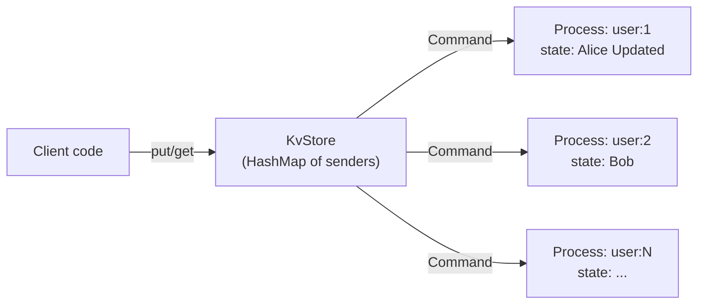

# Getting Started with Rebar

This guide walks you through Rebar's core concepts with progressive, runnable examples. By the end, you will know how to spawn processes, send messages, build request-reply services, supervise process trees, implement process-per-key architectures, and use monitors and links for failure detection.

## Table of Contents

1. [Installation](#1-installation)
2. [Your First Process](#2-your-first-process)
3. [Sending Messages](#3-sending-messages)
4. [Request-Reply Pattern](#4-request-reply-pattern)
5. [Supervisor Trees](#5-supervisor-trees)
6. [Process-per-Key Pattern](#6-process-per-key-pattern)
7. [Monitoring and Linking](#7-monitoring-and-linking)

---

## 1. Installation

Create a new Rust project and add the following dependencies to your `Cargo.toml`:

```toml
[dependencies]
rebar-core = { git = "https://github.com/alexandernicholson/rebar" }
tokio = { version = "1", features = ["full"] }
rmpv = "1"
```

Rebar uses [Tokio](https://tokio.rs) as its async runtime and [MessagePack](https://msgpack.org/) (`rmpv::Value`) as its universal message payload format.

---

## 2. Your First Process

A process in Rebar is a lightweight async task with its own mailbox. You create a `Runtime`, then call `spawn` with a closure that receives a `ProcessContext`.

```rust
use rebar_core::runtime::Runtime;

#[tokio::main]
async fn main() {
    // Create a runtime on node 1.
    let rt = Runtime::new(1);

    // Spawn a process. The closure receives a ProcessContext.
    let pid = rt.spawn(|ctx| async move {
        println!("Hello! I am process {}", ctx.self_pid());
    }).await;

    println!("Spawned process with PID: {}", pid);

    // Give the spawned task a moment to print before main exits.
    tokio::time::sleep(std::time::Duration::from_millis(100)).await;
}
```

**Expected output:**

```
Spawned process with PID: <1.1>
Hello! I am process <1.1>
```

Key points:
- `Runtime::new(node_id)` creates a runtime. The `node_id` identifies this node in a cluster.
- `rt.spawn(handler)` returns a `ProcessId` immediately. The handler runs concurrently.
- `ProcessContext::self_pid()` returns the process's own PID.
- PIDs are displayed as `<node_id.local_id>`, similar to Erlang's PID format.

---

## 3. Sending Messages

Processes communicate exclusively by sending messages to each other's mailboxes. Messages carry an `rmpv::Value` payload, a sender PID, and a timestamp.

```rust
use rebar_core::runtime::Runtime;

#[tokio::main]
async fn main() {
    let rt = Runtime::new(1);

    // Spawn a receiver that waits for messages in a loop.
    let receiver_pid = rt.spawn(|mut ctx| async move {
        println!("[receiver {}] Waiting for messages...", ctx.self_pid());

        while let Some(msg) = ctx.recv().await {
            let text = msg.payload().as_str().unwrap_or("(not a string)");
            println!(
                "[receiver] Got '{}' from {}",
                text,
                msg.from()
            );
        }

        println!("[receiver] Mailbox closed, shutting down.");
    }).await;

    // Spawn a sender that sends three messages to the receiver.
    rt.spawn(move |ctx| async move {
        for greeting in &["hello", "world", "goodbye"] {
            ctx.send(receiver_pid, rmpv::Value::from(*greeting))
                .await
                .unwrap();
        }
        println!("[sender {}] All messages sent.", ctx.self_pid());
    }).await;

    // Wait for processing to complete.
    tokio::time::sleep(std::time::Duration::from_millis(200)).await;
}
```

**Expected output:**

```
[receiver <1.1>] Waiting for messages...
[sender <1.2>] All messages sent.
[receiver] Got 'hello' from <1.2>
[receiver] Got 'world' from <1.2>
[receiver] Got 'goodbye' from <1.2>
```

Key points:
- `ctx.recv()` blocks until a message arrives. Returns `None` when the mailbox is closed (all senders dropped).
- `ctx.send(dest, payload)` sends a message to another process. Returns `Err(SendError::ProcessDead(_))` if the target is gone.
- `msg.from()` identifies the sender. `msg.payload()` is the `rmpv::Value`. `msg.timestamp()` is a Unix timestamp in milliseconds.
- You can also send from outside a process using `rt.send(pid, payload)`, which uses a synthetic sender PID of `<node_id.0>`.

---

## 4. Request-Reply Pattern

In Erlang/OTP, a common pattern is sending a request with the caller's PID so the responder can send back a result. Since `rmpv::Value` cannot carry Rust channels, we encode the requester's PID into the message payload and have the responder send the result back to that PID.

This example implements a calculator process that receives `{op, a, b}` requests and sends back the result.

```rust
use rebar_core::runtime::Runtime;
use std::time::Duration;

#[tokio::main]
async fn main() {
    let rt = Runtime::new(1);

    // Spawn a calculator process that processes requests forever.
    let calc_pid = rt.spawn(|mut ctx| async move {
        println!("[calc {}] Ready for requests.", ctx.self_pid());

        while let Some(msg) = ctx.recv().await {
            // Expect a map: {"op": "add"|"mul", "a": int, "b": int, "reply_to_node": int, "reply_to_local": int}
            if let rmpv::Value::Map(entries) = msg.payload().clone() {
                let mut op = String::new();
                let mut a: i64 = 0;
                let mut b: i64 = 0;
                let mut reply_node: u64 = 0;
                let mut reply_local: u64 = 0;

                for (k, v) in &entries {
                    match k.as_str().unwrap_or("") {
                        "op" => op = v.as_str().unwrap_or("").to_string(),
                        "a" => a = v.as_i64().unwrap_or(0),
                        "b" => b = v.as_i64().unwrap_or(0),
                        "reply_to_node" => reply_node = v.as_u64().unwrap_or(0),
                        "reply_to_local" => reply_local = v.as_u64().unwrap_or(0),
                        _ => {}
                    }
                }

                let result = match op.as_str() {
                    "add" => a + b,
                    "mul" => a * b,
                    _ => {
                        println!("[calc] Unknown op: {}", op);
                        continue;
                    }
                };

                let reply_pid = rebar_core::process::ProcessId::new(reply_node, reply_local);
                let _ = ctx.send(reply_pid, rmpv::Value::from(result)).await;
                println!("[calc] {} {} {} = {}", a, op, b, result);
            }
        }
    }).await;

    // Spawn a requester that sends two calculations and waits for replies.
    rt.spawn(move |mut ctx| async move {
        let me = ctx.self_pid();

        // Build a request: 3 + 7
        let request = rmpv::Value::Map(vec![
            (rmpv::Value::from("op"), rmpv::Value::from("add")),
            (rmpv::Value::from("a"), rmpv::Value::from(3)),
            (rmpv::Value::from("b"), rmpv::Value::from(7)),
            (rmpv::Value::from("reply_to_node"), rmpv::Value::from(me.node_id())),
            (rmpv::Value::from("reply_to_local"), rmpv::Value::from(me.local_id())),
        ]);
        ctx.send(calc_pid, request).await.unwrap();

        // Build a request: 5 * 6
        let request = rmpv::Value::Map(vec![
            (rmpv::Value::from("op"), rmpv::Value::from("mul")),
            (rmpv::Value::from("a"), rmpv::Value::from(5)),
            (rmpv::Value::from("b"), rmpv::Value::from(6)),
            (rmpv::Value::from("reply_to_node"), rmpv::Value::from(me.node_id())),
            (rmpv::Value::from("reply_to_local"), rmpv::Value::from(me.local_id())),
        ]);
        ctx.send(calc_pid, request).await.unwrap();

        // Receive the two results.
        for _ in 0..2 {
            if let Some(reply) = ctx.recv_timeout(Duration::from_secs(1)).await {
                println!("[requester] Got result: {}", reply.payload());
            }
        }
    }).await;

    tokio::time::sleep(Duration::from_millis(300)).await;
}
```

**Expected output:**

```
[calc <1.1>] Ready for requests.
[calc] 3 add 7 = 10
[calc] 5 mul 6 = 30
[requester] Got result: 10
[requester] Got result: 30
```

A simpler alternative is to use `msg.from()` directly, since every message already carries the sender's PID:

```rust
// In the calculator, instead of parsing reply_to from the payload:
let reply_pid = msg.from();
let _ = ctx.send(reply_pid, rmpv::Value::from(result)).await;
```

This works well for simple cases. The explicit-PID-in-payload approach is useful when the reply should go to a process other than the sender, or when requests are forwarded through intermediaries.

---

## 5. Supervisor Trees

Supervisors monitor child processes and restart them according to a strategy when they fail. This is the core of Rebar's fault tolerance, directly inspired by OTP supervisors.

```rust
use rebar_core::process::ExitReason;
use rebar_core::runtime::Runtime;
use rebar_core::supervisor::{
    ChildEntry, ChildSpec, RestartStrategy, RestartType, SupervisorSpec,
    start_supervisor,
};
use std::sync::atomic::{AtomicU32, Ordering};
use std::sync::Arc;
use std::time::Duration;

#[tokio::main]
async fn main() {
    let rt = Arc::new(Runtime::new(1));

    // Track how many times the worker has started.
    let start_count = Arc::new(AtomicU32::new(0));

    // Create a child entry with a factory closure.
    // The factory is called each time the child needs to be (re)started.
    let counter = Arc::clone(&start_count);
    let entry = ChildEntry::new(
        ChildSpec::new("flaky-worker")
            .restart(RestartType::Permanent),  // Always restart
        move || {
            let counter = Arc::clone(&counter);
            async move {
                let n = counter.fetch_add(1, Ordering::SeqCst) + 1;
                println!("[worker] Start #{}", n);

                if n <= 3 {
                    // Simulate a crash on the first 3 starts.
                    println!("[worker] Crashing! (start #{})", n);
                    ExitReason::Abnormal(format!("crash #{}", n))
                } else {
                    // Fourth start: stay alive and do real work.
                    println!("[worker] Running normally (start #{})", n);
                    tokio::time::sleep(Duration::from_secs(60)).await;
                    ExitReason::Normal
                }
            }
        },
    );

    // Configure the supervisor: OneForOne strategy, max 5 restarts in 60 seconds.
    let spec = SupervisorSpec::new(RestartStrategy::OneForOne)
        .max_restarts(5)
        .max_seconds(60);

    // Start the supervisor with our child.
    let handle = start_supervisor(rt.clone(), spec, vec![entry]).await;
    println!("Supervisor started at PID: {}", handle.pid());

    // Wait and observe the restarts.
    tokio::time::sleep(Duration::from_secs(2)).await;

    let total_starts = start_count.load(Ordering::SeqCst);
    println!("Worker started {} times (3 crashes + 1 successful)", total_starts);

    // Clean shutdown.
    handle.shutdown();
    tokio::time::sleep(Duration::from_millis(100)).await;
}
```

**Expected output:**

```
Supervisor started at PID: <1.1>
[worker] Start #1
[worker] Crashing! (start #1)
[worker] Start #2
[worker] Crashing! (start #2)
[worker] Start #3
[worker] Crashing! (start #3)
[worker] Start #4
[worker] Running normally (start #4)
Worker started 4 times (3 crashes + 1 successful)
```

### Restart Strategies

| Strategy | Behavior |
|---|---|
| `OneForOne` | Only the crashed child is restarted |
| `OneForAll` | All children are stopped and restarted when one crashes |
| `RestForOne` | The crashed child and all children started after it are restarted |

### Restart Types

| Type | Behavior |
|---|---|
| `Permanent` | Always restart, regardless of exit reason |
| `Transient` | Only restart on abnormal exit (not `ExitReason::Normal`) |
| `Temporary` | Never restart |

### Dynamic Children

You can add children to a running supervisor:

```rust
let new_entry = ChildEntry::new(
    ChildSpec::new("dynamic-worker"),
    || async {
        println!("[dynamic] I was added at runtime!");
        tokio::time::sleep(std::time::Duration::from_secs(60)).await;
        ExitReason::Normal
    },
);

let child_pid = handle.add_child(new_entry).await.unwrap();
println!("Added dynamic child: {}", child_pid);
```

---

## 6. Process-per-Key Pattern

A powerful pattern is to dedicate one long-lived process per logical key (user, session, device, etc.). Each process owns its state exclusively, eliminating contention. This is the same pattern used in Rebar's benchmark store service.

```rust
use rebar_core::runtime::Runtime;
use std::collections::HashMap;
use std::sync::Arc;
use tokio::sync::{mpsc, oneshot, Mutex};

/// Commands that a key-process handles.
enum Command {
    Get { reply: oneshot::Sender<Option<String>> },
    Put { value: String, reply: oneshot::Sender<()> },
}

/// A simple key-value store backed by one process per key.
struct KvStore {
    runtime: Arc<Runtime>,
    keys: Arc<Mutex<HashMap<String, mpsc::Sender<Command>>>>,
}

impl KvStore {
    fn new(runtime: Arc<Runtime>) -> Self {
        Self {
            runtime,
            keys: Arc::new(Mutex::new(HashMap::new())),
        }
    }

    /// Get or create a dedicated process for the given key.
    async fn get_key_sender(&self, key: &str) -> mpsc::Sender<Command> {
        let mut keys = self.keys.lock().await;
        if let Some(tx) = keys.get(key) {
            return tx.clone();
        }

        // Create a channel for commands to this key's process.
        let (cmd_tx, mut cmd_rx) = mpsc::channel::<Command>(64);

        // Spawn a process that owns the state for this key.
        self.runtime.spawn(move |_ctx| async move {
            let mut value: Option<String> = None;

            while let Some(cmd) = cmd_rx.recv().await {
                match cmd {
                    Command::Get { reply } => {
                        let _ = reply.send(value.clone());
                    }
                    Command::Put { value: v, reply } => {
                        value = Some(v);
                        let _ = reply.send(());
                    }
                }
            }
        }).await;

        keys.insert(key.to_string(), cmd_tx.clone());
        cmd_tx
    }

    /// Get the value for a key.
    async fn get(&self, key: &str) -> Option<String> {
        let sender = self.get_key_sender(key).await;
        let (reply_tx, reply_rx) = oneshot::channel();
        let _ = sender.send(Command::Get { reply: reply_tx }).await;
        reply_rx.await.ok().flatten()
    }

    /// Set the value for a key.
    async fn put(&self, key: &str, value: String) {
        let sender = self.get_key_sender(key).await;
        let (reply_tx, reply_rx) = oneshot::channel();
        let _ = sender.send(Command::Put { value, reply: reply_tx }).await;
        let _ = reply_rx.await;
    }
}

#[tokio::main]
async fn main() {
    let runtime = Arc::new(Runtime::new(1));
    let store = KvStore::new(runtime);

    // Write some keys - each key gets its own dedicated process.
    store.put("user:1", "Alice".to_string()).await;
    store.put("user:2", "Bob".to_string()).await;
    store.put("user:1", "Alice Updated".to_string()).await;

    // Read them back.
    println!("user:1 = {:?}", store.get("user:1").await);
    println!("user:2 = {:?}", store.get("user:2").await);
    println!("user:3 = {:?}", store.get("user:3").await);
}
```

**Expected output:**

```
user:1 = Some("Alice Updated")
user:2 = Some("Bob")
user:3 = None
```

The architecture looks like this:



Key advantages of this pattern:
- **No locks on hot data** -- each key's state lives in exactly one process, so reads and writes never contend.
- **Independent failure** -- if a key-process panics, only that key is affected.
- **Natural backpressure** -- the bounded `mpsc::channel` limits how many commands can queue per key.

---

## 7. Monitoring and Linking

Rebar provides two primitives for tracking process health: **monitors** and **links**. They serve different purposes.

### MonitorSet: One-Way Notifications

A monitor is a one-directional observation. When you monitor a process, you get notified when it exits, but the monitored process is unaffected by your exit.

```rust
use rebar_core::process::monitor::MonitorSet;
use rebar_core::process::ProcessId;

fn main() {
    let mut monitors = MonitorSet::new();

    // Monitor two processes.
    let worker_a = ProcessId::new(1, 10);
    let worker_b = ProcessId::new(1, 20);

    let ref_a = monitors.add_monitor(worker_a);
    let ref_b = monitors.add_monitor(worker_b);

    // You can monitor the same target multiple times (each gets a unique ref).
    let ref_a2 = monitors.add_monitor(worker_a);

    // Query who is watching a target.
    println!("Monitors on worker_a: {}",
        monitors.monitors_for(worker_a).count());  // 2
    println!("Monitors on worker_b: {}",
        monitors.monitors_for(worker_b).count());  // 1

    // Remove a specific monitor.
    monitors.remove_monitor(ref_a);
    println!("After removing ref_a, monitors on worker_a: {}",
        monitors.monitors_for(worker_a).count());  // 1

    // Remove remaining monitors.
    monitors.remove_monitor(ref_a2);
    monitors.remove_monitor(ref_b);
    println!("After cleanup, monitors on worker_a: {}",
        monitors.monitors_for(worker_a).count());  // 0
}
```

**Expected output:**

```
Monitors on worker_a: 2
Monitors on worker_b: 1
After removing ref_a, monitors on worker_a: 1
After cleanup, monitors on worker_a: 0
```

### LinkSet: Bidirectional Failure Propagation

Links create a bidirectional relationship: if either linked process dies abnormally, the other is also terminated. This is how Erlang's process linking works.

```rust
use rebar_core::process::monitor::LinkSet;
use rebar_core::process::ProcessId;

fn main() {
    let mut links = LinkSet::new();

    let worker = ProcessId::new(1, 10);
    let supervisor = ProcessId::new(1, 20);
    let logger = ProcessId::new(1, 30);

    // Establish links.
    links.add_link(worker);
    links.add_link(supervisor);

    // Check link status.
    println!("Linked to worker? {}", links.is_linked(worker));       // true
    println!("Linked to supervisor? {}", links.is_linked(supervisor)); // true
    println!("Linked to logger? {}", links.is_linked(logger));       // false

    // Adding a duplicate link is idempotent.
    links.add_link(worker);
    println!("Linked PIDs count: {}", links.linked_pids().count());  // 2

    // Remove a link.
    links.remove_link(worker);
    println!("Linked to worker after removal? {}", links.is_linked(worker)); // false

    // Iterate over remaining linked PIDs.
    for pid in links.linked_pids() {
        println!("Still linked to: {}", pid);
    }
}
```

**Expected output:**

```
Linked to worker? true
Linked to supervisor? true
Linked to logger? false
Linked PIDs count: 2
Linked to worker after removal? false
Still linked to: <1.20>
```

### Detecting Process Death in Practice

While the full monitor-to-runtime integration is being wired up, you can detect process death by observing `SendError::ProcessDead` when sending to a terminated process:

```rust
use rebar_core::runtime::Runtime;
use std::time::Duration;

#[tokio::main]
async fn main() {
    let rt = Runtime::new(1);

    // Spawn a short-lived process that exits immediately.
    let target = rt.spawn(|_ctx| async move {
        println!("[target] Starting and exiting immediately.");
    }).await;

    // Spawn a watcher that polls the target.
    let (detected_tx, detected_rx) = tokio::sync::oneshot::channel::<bool>();

    rt.spawn(move |ctx| async move {
        // Give the target a moment to exit.
        tokio::time::sleep(Duration::from_millis(50)).await;

        // Try to send - if the process is dead, we get an error.
        match ctx.send(target, rmpv::Value::Nil).await {
            Ok(()) => {
                println!("[watcher] Target is still alive.");
                let _ = detected_tx.send(false);
            }
            Err(e) => {
                println!("[watcher] Target is dead: {}", e);
                let _ = detected_tx.send(true);
            }
        }
    }).await;

    let is_dead = tokio::time::timeout(Duration::from_secs(2), detected_rx)
        .await
        .unwrap()
        .unwrap();

    println!("Detected target death: {}", is_dead);
}
```

**Expected output:**

```
[target] Starting and exiting immediately.
[watcher] Target is dead: process dead: <1.1>
Detected target death: true
```

### Monitors vs Links: When to Use Which

| Aspect | Monitor | Link |
|---|---|---|
| Direction | One-way (observer is notified) | Bidirectional (both processes affected) |
| Effect on observer | Receives notification only | Terminated if linked process dies abnormally |
| Multiplicity | Can add multiple monitors to same target | Idempotent (only one link per pair) |
| Use case | Health checking, dashboards, logging | Coupled processes that should fail together |
| Erlang equivalent | `erlang:monitor/2` | `erlang:link/1` |

In OTP style, supervisors use monitors to watch children (so the supervisor can restart them without being killed itself), while worker processes that depend on each other use links (so they fail together and let the supervisor handle the restart).

---

## Next Steps

- Read the [Architecture Guide](architecture.md) for a deeper understanding of Rebar's internals.
- See the [Extending Rebar](extending.md) guide for building custom supervision patterns, transports, and registry backends.
- Check the API Reference: [rebar-core](api/rebar-core.md) | [rebar-cluster](api/rebar-cluster.md) | [rebar-ffi](api/rebar-ffi.md) for complete type documentation.
- Explore the internals: [Supervisor Engine](internals/supervisor-engine.md) | [Wire Protocol](internals/wire-protocol.md) | [SWIM Protocol](internals/swim-protocol.md) | [CRDT Registry](internals/crdt-registry.md).
- Run the [benchmarks](benchmarks.md) to see Rebar's performance characteristics.
