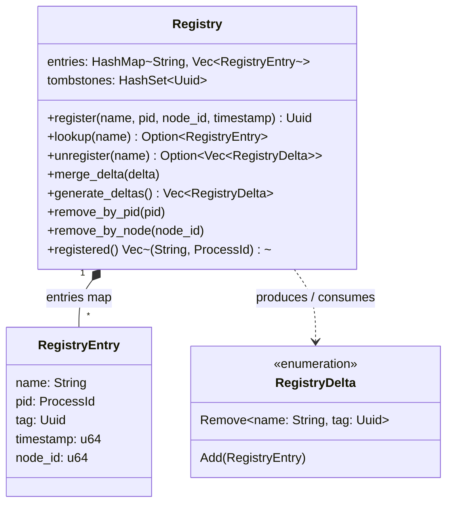
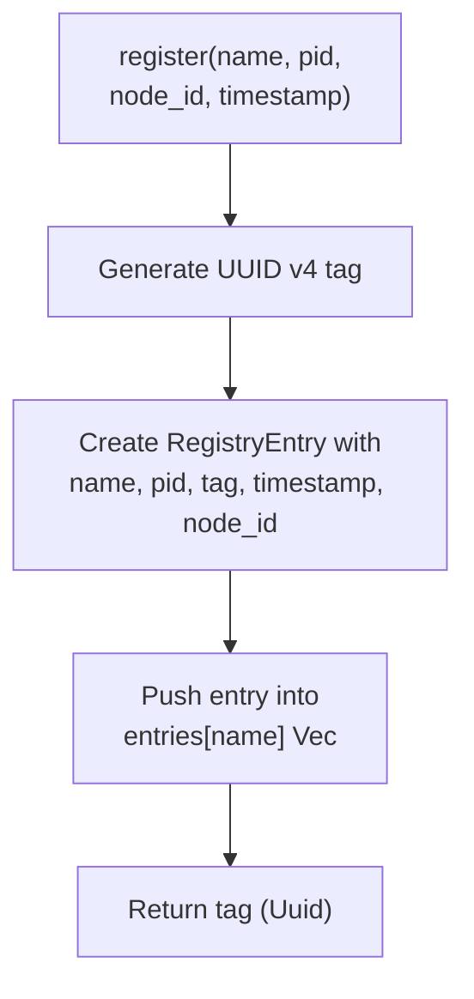
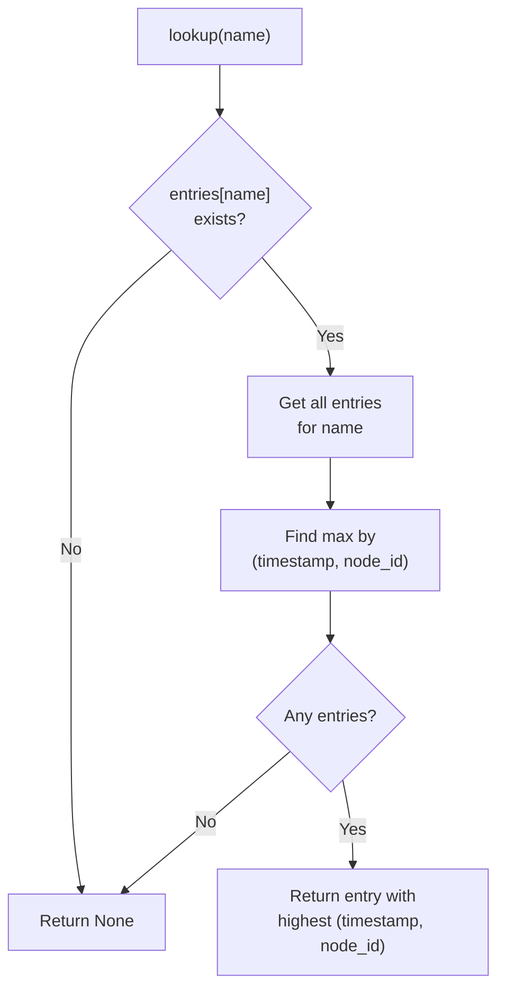
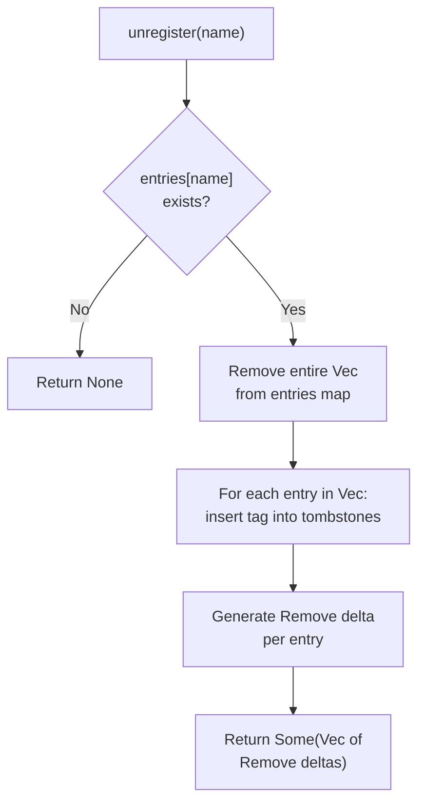
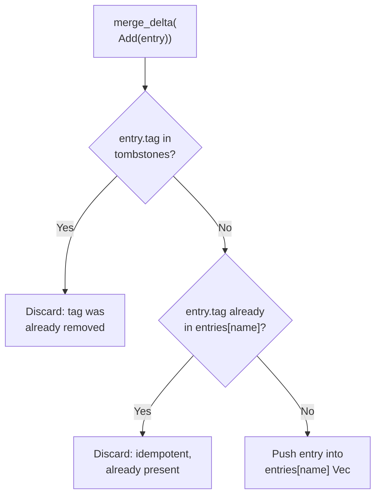
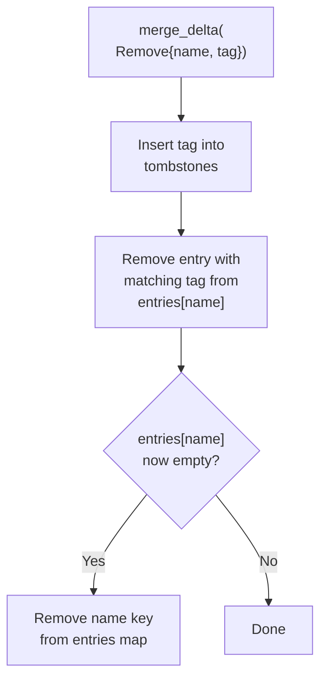

# CRDT Registry Internals

> Source: `crates/rebar-cluster/src/registry/orset.rs`

## Overview

Rebar's global process registry uses an **OR-Set CRDT** (Observed-Remove Set) with **Last-Writer-Wins (LWW)** conflict resolution. Any node can register or unregister process names without coordination. Eventual consistency is guaranteed: once all deltas have been exchanged, every node will resolve the same winner for every name.

## Why OR-Set?

| Property | Benefit |
|---|---|
| No locks or consensus | Names can be registered on any node independently |
| LWW conflict resolution | Concurrent registrations resolve deterministically |
| UUID-tagged entries | Removals are precise -- the "add-remove" anomaly is eliminated |
| Convergence without coordination | Nodes reach the same state by exchanging deltas, regardless of delivery order |

In a traditional set CRDT, concurrent add and remove of the same element can lead to surprising results (the element reappears). The OR-Set avoids this by tagging each addition with a unique UUID. A remove operation targets specific tags, not the element itself, so it can never accidentally undo a concurrent add that it has not observed.

## Data Model



**Key fields:**

- **`entries`** -- Maps each registered name to a `Vec<RegistryEntry>`. Multiple entries can exist for the same name (concurrent registrations from different nodes). The `lookup` method picks the LWW winner.
- **`tombstones`** -- A `HashSet<Uuid>` of tags that have been removed. A tombstoned tag can never be re-added, preventing resurrection after merge.
- **`RegistryEntry`** -- A single registration: the process name, the `ProcessId` it maps to, a unique `Uuid` tag, a logical timestamp, and the originating node ID.
- **`RegistryDelta`** -- Either an `Add` (carrying a full `RegistryEntry`) or a `Remove` (carrying the name and the specific tag to tombstone).

## Registration



Step by step:

1. Generate a fresh `Uuid::new_v4()` tag. This uniquely identifies this particular registration act.
2. Construct a `RegistryEntry` with the provided name, pid, node_id, timestamp, and the new tag.
3. Push the entry into the `entries` HashMap under the name key (using `entry().or_default().push()`).
4. Return the UUID tag to the caller. The caller can later use this tag for precise unregistration, and should produce an `Add` delta for replication to other nodes.

Multiple registrations for the same name are allowed. They coexist in the entries Vec, and `lookup` resolves the winner using LWW.

## Lookup (LWW Conflict Resolution)



The lookup algorithm:

1. Retrieve all entries for the given name from the HashMap.
2. If no entries exist, return `None`.
3. Among all entries, select the one with the maximum `(timestamp, node_id)` tuple. Comparison is done by timestamp first; if timestamps are equal, the higher node_id wins as a deterministic tiebreaker.
4. Return a reference to the winning entry.

**Determinism guarantee:** All nodes that hold the same set of entries for a name will pick the same winner, because the comparison function `(timestamp, node_id)` is a total order. This is critical for convergence -- there is no ambiguity about who owns a name once deltas have been fully exchanged.

Note: the current implementation does **not** filter out tombstoned entries during lookup. Tombstoned entries are removed from the entries map at the time they are tombstoned (in `unregister` or `merge_delta(Remove)`), so they are never present in the Vec at lookup time. The tombstone set exists solely to prevent re-addition via `merge_delta(Add)`.

## Unregistration



Step by step:

1. Remove all entries for the given name from the HashMap (using `HashMap::remove`).
2. If the name had no entries (or the Vec was empty), return `None`.
3. For each removed entry, insert its tag into the tombstone set.
4. Generate a `RegistryDelta::Remove { name, tag }` for each entry.
5. Return the list of Remove deltas. The caller should replicate these to other nodes.

This removes **all** registrations for a name, not just the current winner. Every tag is tombstoned, ensuring that delayed `Add` deltas for those tags will be rejected by `merge_delta`.

## Delta Merging

The `merge_delta` method is the core of CRDT replication. It handles incoming deltas from remote nodes.

### Add Delta



1. If the tag is in the tombstone set, reject the add. This prevents resurrection of removed entries.
2. If an entry with the same tag already exists in the Vec, skip it. This makes the operation idempotent.
3. Otherwise, push the entry into the entries Vec for that name.

### Remove Delta



1. Insert the tag into the tombstone set (unconditionally).
2. If entries exist for the name, retain only those whose tag does not match.
3. If the Vec becomes empty, remove the key from the HashMap entirely.

### Idempotency

Applying the same delta twice has no effect:

- **Add**: The second application finds the tag already present and skips.
- **Remove**: The second application finds the tag already tombstoned and the entry already gone.

This means deltas can be safely retransmitted, reordered, or duplicated without corrupting state.

## Full State Sync

```rust
pub fn generate_deltas(&self) -> Vec<RegistryDelta>
```

Produces a complete snapshot of the registry as a list of deltas:

1. For every live entry across all names, emit an `Add` delta.
2. For every tag in the tombstone set, emit a `Remove` delta. Since the original entry may have already been cleaned up, these Remove deltas use an empty name string -- the receiver only needs the tag UUID to prevent resurrection.

This is used for:

- **New node bootstrap**: A joining node receives the full delta set and applies each one via `merge_delta`.
- **Partition recovery**: After a network partition heals, nodes can exchange full state to reconcile divergence.

Because `merge_delta` is idempotent, it is safe to apply `generate_deltas()` output even if the receiver already has some of the entries.

## Node and PID Cleanup

### remove_by_pid(pid)

Removes all entries across all names that point to the given `ProcessId`. For each matching entry:

1. Insert its tag into the tombstone set.
2. Remove it from the entries Vec.
3. If the Vec becomes empty, remove the name key from the map.

Used when a process terminates -- all of its registered names are cleaned up.

### remove_by_node(node_id)

Removes all entries across all names that originated from the given node. Same mechanics as `remove_by_pid`, but filtering on `node_id` instead of `pid`.

Used when the SWIM failure detector declares a node dead. All registrations from that node are purged, ensuring stale names do not persist.

## Convergence Example

Consider two nodes, A (node_id=1) and B (node_id=2), both registering the name `"worker"` concurrently:

```
Timeline:
  Node A: register("worker", pid(1,10), node_id=1, timestamp=100) -> tag_a
  Node B: register("worker", pid(2,20), node_id=2, timestamp=200) -> tag_b
```

**Before delta exchange:**

| Node | entries["worker"] | lookup("worker") |
|---|---|---|
| A | `[{pid(1,10), tag_a, ts=100, node=1}]` | pid(1,10) |
| B | `[{pid(2,20), tag_b, ts=200, node=2}]` | pid(2,20) |

Each node sees only its own registration.

**After A sends its delta to B:**

Node B merges `Add({pid(1,10), tag_a, ts=100, node=1})`. Since `tag_a` is not tombstoned and not already present, it is added.

| Node | entries["worker"] | lookup("worker") |
|---|---|---|
| A | `[{pid(1,10), tag_a, ts=100, node=1}]` | pid(1,10) |
| B | `[{pid(2,20), tag_b, ts=200, node=2}, {pid(1,10), tag_a, ts=100, node=1}]` | pid(2,20) -- ts 200 > 100 |

**After B sends its delta to A:**

Node A merges `Add({pid(2,20), tag_b, ts=200, node=2})`.

| Node | entries["worker"] | lookup("worker") |
|---|---|---|
| A | `[{pid(1,10), tag_a, ts=100, node=1}, {pid(2,20), tag_b, ts=200, node=2}]` | pid(2,20) -- ts 200 > 100 |
| B | `[{pid(2,20), tag_b, ts=200, node=2}, {pid(1,10), tag_a, ts=100, node=1}]` | pid(2,20) -- ts 200 > 100 |

**Result:** Both nodes agree that `"worker"` maps to `pid(2,20)` from node 2, because timestamp 200 > 100.

### Same-timestamp tiebreaker

If both registrations had `timestamp=500`:

```
lookup compares (500, 1) vs (500, 2)
  timestamps equal -> compare node_id: 2 > 1
  winner: node 2
```

Both nodes would still converge to the same answer: the entry from the higher node_id wins.

## Tombstone Lifecycle

Tombstones are **never garbage collected** in the current implementation. Once a UUID tag enters the `tombstones` HashSet, it remains there indefinitely.

This is a deliberate trade-off:

- **Correctness**: A tombstone ensures that a delayed `Add` delta for a removed entry will always be rejected, no matter how late it arrives. Without the tombstone, a slow `Add` delta could resurrect a name that was already unregistered.
- **Memory cost**: Each tombstone is a single `Uuid` (16 bytes). Over time, this set grows monotonically.

**Future work:** Tombstone expiration could be added with a protocol guarantee that deltas older than some threshold will never be delivered. This would allow periodic GC of old tombstones, bounding memory usage. However, this requires careful coordination with the delta replication layer to ensure safety.
