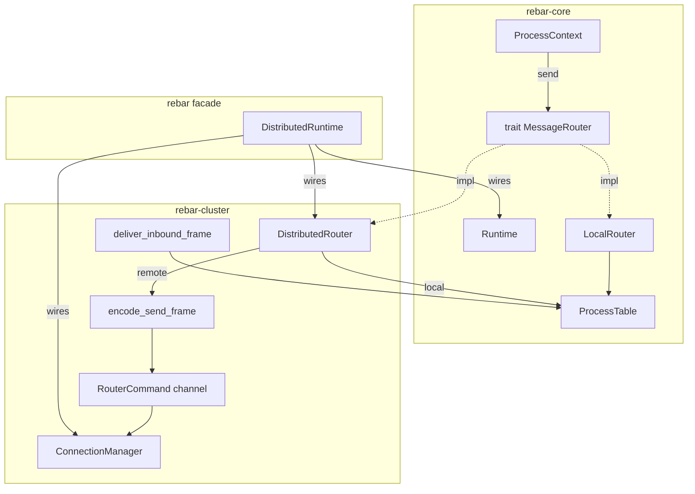
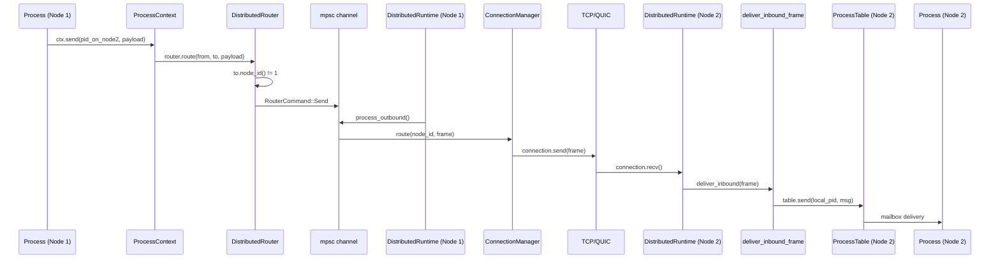

# Distribution Layer Internals

This document describes how Rebar routes messages transparently across nodes.

## Overview

Rebar's distribution layer makes `ctx.send(pid, payload)` work identically whether the target process is local or remote. The key design principle: the `MessageRouter` trait lives in `rebar-core` (which has no network dependencies), while its distributed implementation lives in `rebar-cluster`.

## Architecture



## MessageRouter Trait

Defined in `crates/rebar-core/src/router.rs`:

```rust
pub trait MessageRouter: Send + Sync {
    fn route(&self, from: ProcessId, to: ProcessId, payload: rmpv::Value)
        -> Result<(), SendError>;
}
```

**Why in rebar-core?** This keeps the core crate free of network dependencies. The `Runtime` and `ProcessContext` only know about the trait, not the implementation. Single-node users get `LocalRouter` with zero network overhead.

## LocalRouter

The default router. Wraps `Arc<ProcessTable>` and calls `table.send(to, Message::new(from, payload))`.

Used by `Runtime::new()` — you get local routing automatically with no extra setup.

## DistributedRouter

Defined in `crates/rebar-cluster/src/router.rs`. Routing decision:

```rust
fn route(&self, from, to, payload) -> Result<(), SendError> {
    if to.node_id() == self.node_id {
        // Local delivery via ProcessTable
        let msg = Message::new(from, payload);
        self.table.send(to, msg)
    } else {
        // Remote: encode and send to transport layer
        let frame = encode_send_frame(from, to, payload);
        self.remote_tx.try_send(RouterCommand::Send { node_id, frame })
            .map_err(|_| SendError::NodeUnreachable(to.node_id()))
    }
}
```

Key design choices:
- **`try_send` not `send`**: the router is called from sync context (the `MessageRouter` trait is not async), so it uses `try_send` on the mpsc channel. If the channel is full, the caller gets `SendError::NodeUnreachable`.
- **Channel decoupling**: the router never touches the network directly. It pushes `RouterCommand`s to a channel, and a separate task (`process_outbound()`) drains the channel and hands frames to the `ConnectionManager`.

## Frame Encoding

`encode_send_frame(from, to, payload)` produces a `Frame` with:
- `version: 1`
- `msg_type: MsgType::Send`
- `request_id: 0`
- `header`: MessagePack Map with keys `from_node`, `from_local`, `to_node`, `to_local`
- `payload`: the original `rmpv::Value`

`deliver_inbound_frame(table, frame)` reverses this: extracts PIDs from the header map, constructs a `Message`, delivers via `table.send()`.

## DistributedRuntime

Defined in `crates/rebar/src/lib.rs`. Wires everything together:

```rust
pub struct DistributedRuntime {
    runtime: Runtime,
    table: Arc<ProcessTable>,
    connection_manager: ConnectionManager,
    remote_rx: mpsc::Receiver<RouterCommand>,
}
```

Construction flow:
1. Creates `ProcessTable` with the node ID
2. Creates mpsc channel (capacity 1024) for `RouterCommand`s
3. Creates `DistributedRouter` with the table and channel sender
4. Creates `Runtime::with_router()` with the distributed router
5. Stores the channel receiver for `process_outbound()`

Key methods:
- `process_outbound()` — dequeues one `RouterCommand` and routes it via `ConnectionManager`
- `deliver_inbound(frame)` — calls `deliver_inbound_frame(table, frame)` for incoming messages
- `runtime()` — access the underlying `Runtime` for spawn/send
- `connection_manager_mut()` — access the `ConnectionManager` for connect/disconnect

## End-to-End Message Flow

Complete flow of `ctx.send(remote_pid, payload)` across two nodes:


