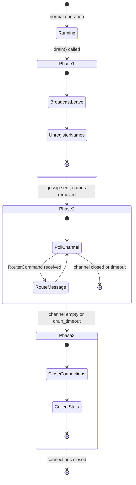
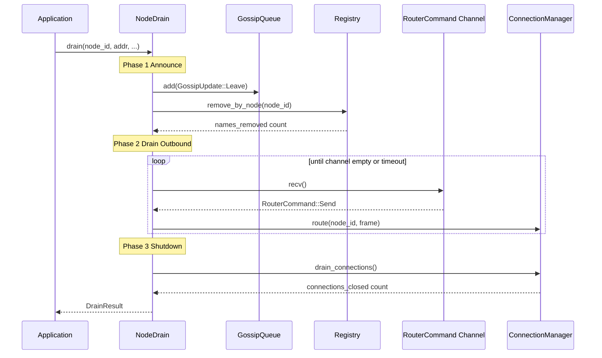

# Node Drain Internals

This document describes the graceful node drain protocol in `crates/rebar-cluster/src/drain.rs`.

## Overview

When a node needs to leave the cluster (deployment, scaling down, maintenance), it should drain gracefully rather than disappearing abruptly. An abrupt departure causes:
- In-flight messages to be lost
- Other nodes to wait for SWIM failure detection (5s suspect + 30s dead timeout)
- Registered names to become stale until cleanup

The drain protocol addresses all three by proactively announcing departure, flushing outbound messages, and closing connections.

## Three-Phase Protocol



## Phase 1: Announce

**Method:** `NodeDrain::announce(node_id, addr, gossip, registry) -> usize`

Actions:
1. **Broadcast Leave**: Enqueues `GossipUpdate::Leave { node_id, addr }` into the gossip queue. Other nodes will receive this and immediately mark the member as Dead (skipping the Suspect phase).
2. **Unregister names**: Calls `registry.remove_by_node(node_id)` to remove all names registered by this node from the CRDT registry. Returns the count of names removed.

The announce phase is synchronous — it completes immediately. The `announce_timeout` in `DrainConfig` exists for future use (e.g., waiting for gossip propagation confirmation).

## Phase 2: Drain Outbound

**Method:** `NodeDrain::drain_outbound(remote_rx, connection_manager) -> (usize, bool)`

Processes remaining `RouterCommand`s from the mpsc channel:

```rust
loop {
    if elapsed >= drain_timeout { return (count, true); }  // timed out
    match timeout(remaining, remote_rx.recv()).await {
        Ok(Some(RouterCommand::Send { node_id, frame })) => {
            connection_manager.route(node_id, &frame).await;
            count += 1;
        }
        Ok(None) => break,    // channel closed, all senders dropped
        Err(_) => break,       // timeout
    }
}
```

Returns `(messages_drained, timed_out)`. The drain is considered successful even if it times out — the count tells you how many messages were flushed.

**When does the channel close?** When all `RouterCommand` senders (held by `DistributedRouter` instances) are dropped. In practice, you should drop or replace the router before draining.

## Phase 3: Shutdown

The final phase calls `connection_manager.drain_connections()` which closes all active connections and returns the count of connections closed.

## Full Drain Orchestration

**Method:** `NodeDrain::drain(node_id, addr, gossip, registry, remote_rx, connection_manager, process_count) -> DrainResult`

Runs all three phases in sequence, timing each:

```rust
// Phase 1
let names = self.announce(node_id, addr, gossip, registry);
phase_durations[0] = phase1_start.elapsed();

// Phase 2
let (drained, phase2_timed_out) = self.drain_outbound(remote_rx, mgr).await;
phase_durations[1] = phase2_start.elapsed();

// Phase 3
let closed = mgr.drain_connections().await;
phase_durations[2] = phase3_start.elapsed();

DrainResult { processes_stopped: process_count, messages_drained: drained, phase_durations, timed_out }
```

## DrainConfig Tuning

| Parameter | Default | When to adjust |
|-----------|---------|----------------|
| `announce_timeout` | 5s | Increase for large clusters where gossip propagation is slow |
| `drain_timeout` | 30s | Decrease for dev/test. Increase if nodes have large outbound queues. |
| `shutdown_timeout` | 10s | Increase if connections are slow to close (e.g., QUIC with pending streams) |

## DrainResult Observability

| Field | Type | Meaning |
|-------|------|---------|
| `processes_stopped` | `usize` | Passed in by caller — the number of processes that were running on this node |
| `messages_drained` | `usize` | RouterCommands processed during phase 2 |
| `phase_durations` | `[Duration; 3]` | Wall-clock time for [announce, drain, shutdown] |
| `timed_out` | `bool` | true if phase 2 hit the drain_timeout |

## Sequence Diagram


