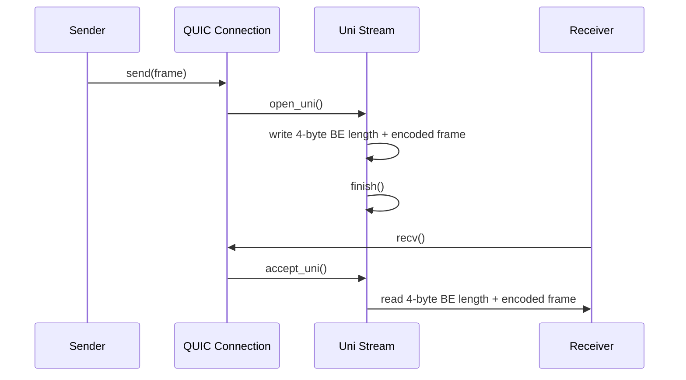

# QUIC Transport Internals

This document describes the QUIC transport implementation in `crates/rebar-cluster/src/transport/quic.rs`.

## Overview

Rebar's QUIC transport provides encrypted, multiplexed node-to-node communication. It uses:
- **quinn 0.11** — Rust QUIC implementation
- **rustls** — TLS 1.3 for the QUIC handshake
- **rcgen** — self-signed certificate generation
- **sha2** — SHA-256 certificate fingerprinting

The transport integrates with Rebar's existing `TransportConnection` and `TransportListener` traits, making it a drop-in replacement for the TCP transport.

## Certificate Generation

```rust
pub fn generate_self_signed_cert() -> (CertificateDer<'static>, PrivateKeyDer<'static>, CertHash)
```

Uses `rcgen::generate_simple_self_signed` with subject alt name `"rebar-node"`. Returns:
1. **DER-encoded certificate** — the X.509 certificate bytes
2. **PKCS8 private key** — for the TLS handshake
3. **CertHash** — `[u8; 32]` SHA-256 fingerprint

The fingerprint is computed by `cert_fingerprint()`:

```rust
pub fn cert_fingerprint(cert: &CertificateDer<'_>) -> CertHash {
    let mut hasher = Sha256::new();
    hasher.update(cert.as_ref());
    hasher.finalize().into()
}
```

Fingerprints are deterministic: the same certificate always produces the same hash.

## Certificate Verification

Instead of a CA trust chain, Rebar uses fingerprint-based verification. The `FingerprintVerifier` struct implements `rustls::client::danger::ServerCertVerifier`:

```rust
struct FingerprintVerifier {
    expected_cert_hash: CertHash,
}
```

The `verify_server_cert` method computes the SHA-256 fingerprint of the presented certificate and compares it to the expected hash. If they match, the connection is accepted. If not, a `rustls::Error::General("certificate fingerprint mismatch")` is returned.

TLS 1.2 and 1.3 signature verification methods unconditionally return success — the fingerprint check is the sole trust anchor.

## Stream-per-Frame Model

Each frame is sent on its own QUIC unidirectional stream:



**Why stream-per-frame?**
- No head-of-line blocking: a slow frame doesn't delay others
- Natural backpressure: QUIC flow control applies per-stream
- Simplified framing: each stream carries exactly one message

### Wire Format

```text
+------------------+------------------+
| length: u32 (BE) | frame: [u8; len] |
+------------------+------------------+
```

The `frame` bytes are produced by `Frame::encode()` and consumed by `Frame::decode()`.

## Transport Types

### QuicTransport

The main transport struct. Holds the certificate and private key.

```rust
pub struct QuicTransport {
    cert: CertificateDer<'static>,
    key: PrivateKeyDer<'static>,
}
```

- `listen(addr)` — creates a quinn `Endpoint` with server config, returns `QuicListener`
- `connect(addr, expected_cert_hash)` — creates a client endpoint with `FingerprintVerifier`, returns `QuicConnection`

### QuicListener

Wraps a quinn `Endpoint` for accepting incoming connections.

- `local_addr()` — returns the bound address
- `accept()` — waits for and accepts an incoming QUIC connection

### QuicConnection

Wraps a quinn `Connection`. Implements `TransportConnection`.

- `send(frame)` — opens unidirectional stream, writes length-prefixed frame, finishes stream
- `recv()` — accepts unidirectional stream, reads length-prefixed frame
- `close()` — sends QUIC close with code 0 and reason `b"done"`

## QuicTransportConnector

Integrates QUIC with the `ConnectionManager`:

```rust
pub struct QuicTransportConnector {
    cert: CertificateDer<'static>,
    key: PrivateKeyDer<'static>,
    expected_cert_hash: CertHash,
}
```

Each `connect()` call creates a fresh `QuicTransport` with cloned credentials. This ensures clean endpoint state per connection.

**Implements:** `TransportConnector` — used by `ConnectionManager::connect()` and `on_node_discovered()`.

## SWIM Certificate Exchange

The `cert_hash` field flows through SWIM gossip:

1. `Member.cert_hash: Option<[u8; 32]>` — stored in the membership list
2. `GossipUpdate::Alive { cert_hash, .. }` — carried in gossip messages

When a node joins and advertises its `cert_hash`, other nodes can automatically establish verified QUIC connections. This eliminates the need for a PKI or manual certificate distribution.

## Configuration

The QUIC transport uses `ring` as its crypto provider:

```rust
let provider = Arc::new(rustls::crypto::ring::default_provider());
```

Server config: no client auth, single cert.
Client config: custom `FingerprintVerifier`, no client auth.
