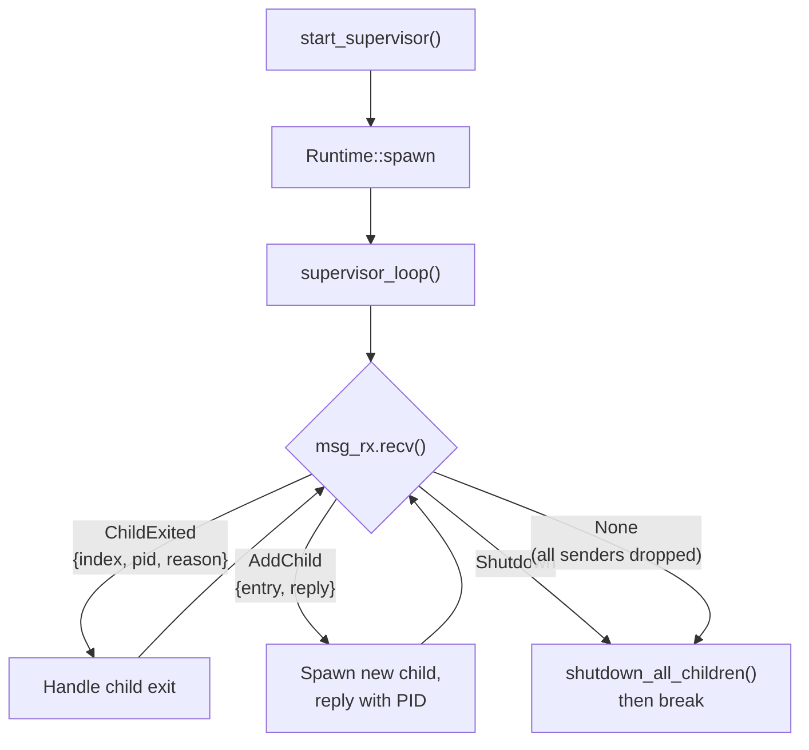
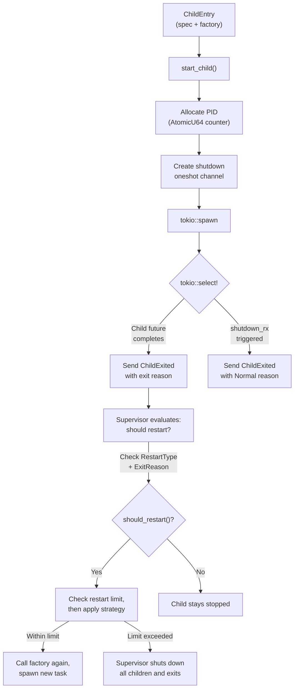
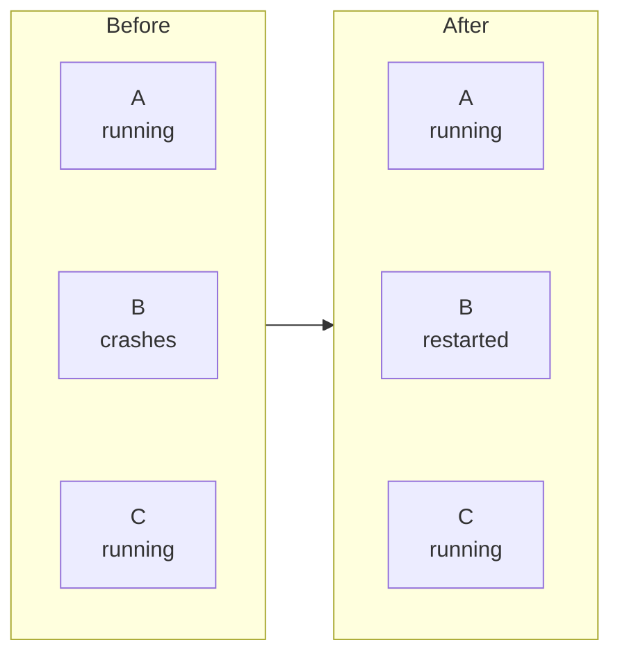
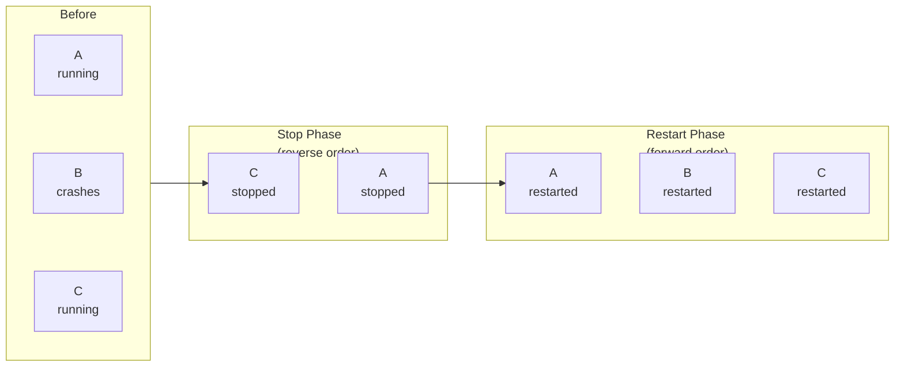
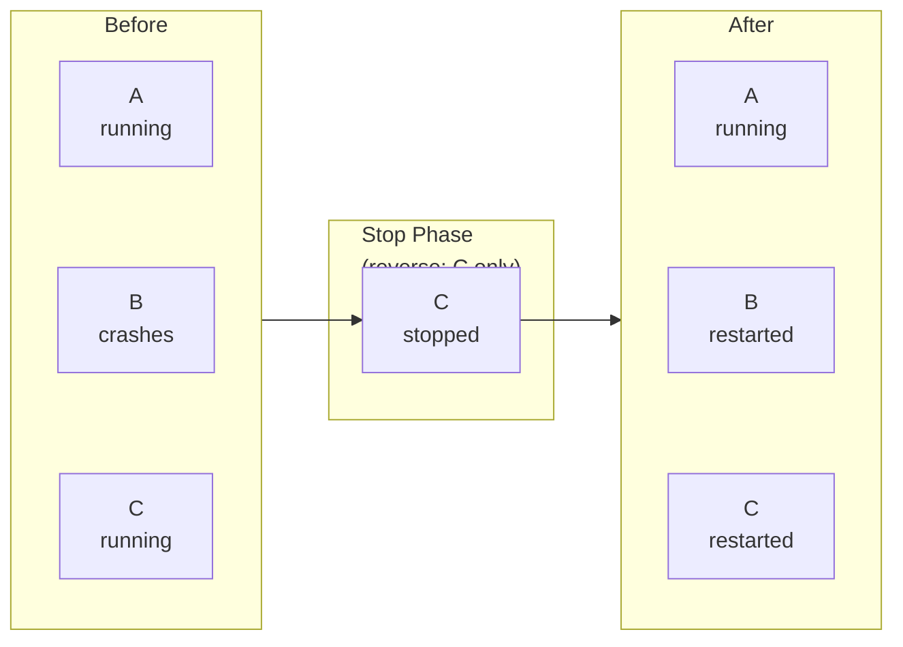
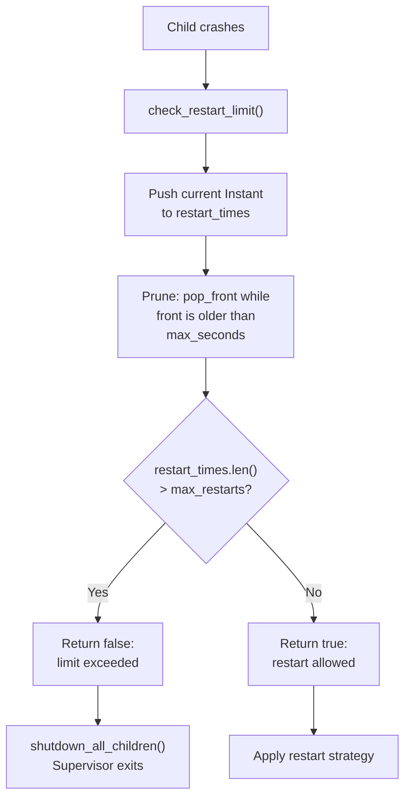
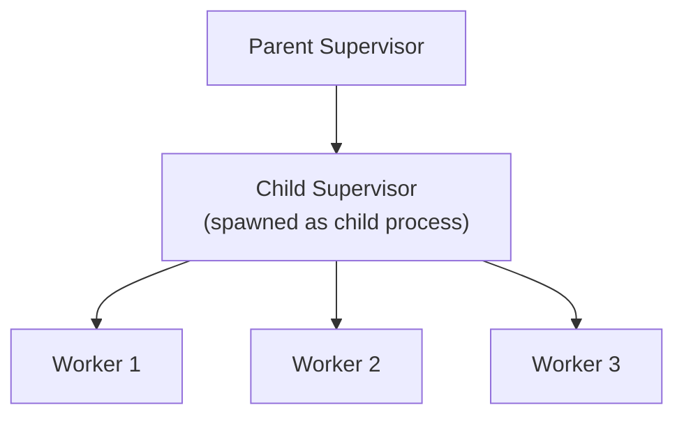

# Supervisor Engine Internals

## Overview

Rebar implements OTP-style supervision trees. A supervisor is itself a process (spawned via `Runtime::spawn`) that monitors child processes and restarts them according to configurable strategies. The implementation lives in two files:

- `crates/rebar-core/src/supervisor/engine.rs` -- the runtime engine (message loop, child spawning, restart logic)
- `crates/rebar-core/src/supervisor/spec.rs` -- the specification types (`SupervisorSpec`, `ChildSpec`, `RestartStrategy`, etc.)

## Supervisor as a Process

A supervisor is a tokio task running a message loop. It is spawned via `Runtime::spawn`, which gives it a real `ProcessId`. The supervisor receives messages through an unbounded `mpsc` channel:



The `SupervisorHandle` returned by `start_supervisor()` holds the supervisor's PID and a clone of the `msg_tx` sender, allowing external code to call `add_child()` or `shutdown()`.

## Child Lifecycle

Each child is defined by a `ChildEntry` pairing a `ChildSpec` with a `ChildFactory`. The factory is an `Arc<dyn Fn() -> Pin<Box<dyn Future<Output = ExitReason> + Send>>>`, allowing it to be called multiple times for restarts.



Inside `start_child()`, the child future and the shutdown receiver are raced with `tokio::select!`. Whichever completes first determines the exit path. If the shutdown channel fires, the child reports a `Normal` exit.

## Restart Strategies

Three strategies control which children are restarted when one crashes. In all diagrams below, child B crashes.

### OneForOne

Only the crashed child is restarted. All other children continue running undisturbed.



Implementation: `start_child()` is called only for the crashed child's index.

### OneForAll

All children are stopped (in reverse order), then all are restarted (in forward order).



Implementation: iterate `(0..len).rev()` calling `stop_child()` on every running child except the already-exited one, then iterate `0..len` calling `start_child()` on all.

### RestForOne

Children after the crashed one are stopped (in reverse order), then the crashed child and all subsequent children are restarted (in forward order). Children before the crashed one are unaffected.



Implementation: iterate `(index+1..len).rev()` calling `stop_child()`, then iterate `index..len` calling `start_child()`.

## Restart Limiting

The supervisor enforces a sliding-window restart limit to prevent infinite restart loops. The algorithm uses a `VecDeque<Instant>` to track timestamps of recent restarts.



The defaults are `max_restarts = 3` and `max_seconds = 5`, meaning: if more than 3 restarts occur within any 5-second window, the supervisor shuts down.

**Special case:** if `max_restarts == 0`, the very first restart immediately triggers shutdown (the method returns `false` before even recording the timestamp).

The exact implementation in `check_restart_limit()`:

```rust
fn check_restart_limit(&mut self) -> bool {
    if self.max_restarts == 0 {
        return false;
    }

    let now = Instant::now();
    let window = Duration::from_secs(self.max_seconds as u64);

    // Add current restart
    self.restart_times.push_back(now);

    // Trim restarts outside the window
    while let Some(&front) = self.restart_times.front() {
        if now.duration_since(front) > window {
            self.restart_times.pop_front();
        } else {
            break;
        }
    }

    // Check if count exceeds max
    (self.restart_times.len() as u32) <= self.max_restarts
}
```

## RestartType Logic

The `RestartType` enum on each `ChildSpec` determines whether a child should be restarted based on its exit reason. The `should_restart()` method implements this:

| RestartType | Normal Exit | Abnormal Exit | Kill |
|---|---|---|---|
| `Permanent` | yes | yes | yes |
| `Transient` | no | yes | yes |
| `Temporary` | no | no | no |

```rust
impl RestartType {
    pub fn should_restart(&self, reason: &ExitReason) -> bool {
        match self {
            RestartType::Permanent => true,
            RestartType::Transient => !reason.is_normal(),
            RestartType::Temporary => false,
        }
    }
}
```

`ExitReason::is_normal()` returns `true` only for `ExitReason::Normal`. All other variants (`Abnormal(String)`, `Kill`, `LinkedExit(...)`) are considered non-normal.

**Default:** `ChildSpec::new()` sets `RestartType::Permanent`.

## Shutdown Strategies

When the supervisor needs to stop a child (during strategy application or supervisor shutdown), it uses the child's configured `ShutdownStrategy`:

- **`Timeout(Duration)`:** Send a shutdown signal via the oneshot channel (`tx.send(())`), then wait briefly (up to the specified duration). The child's `tokio::select!` picks up the signal and exits with `ExitReason::Normal`.

- **`BrutalKill`:** Drop the oneshot sender immediately. Since the receiver is held inside the child's `tokio::select!`, dropping the sender causes the shutdown branch to resolve, terminating the child.

**Default:** `ChildSpec::new()` sets `ShutdownStrategy::Timeout(Duration::from_secs(5))`.

The `stop_child()` function also calls `tokio::task::yield_now().await` after signaling to give the child task a chance to complete, then sets `child.pid = None`.

All children are shut down in **reverse order** by `shutdown_all_children()`, which iterates `(0..children.len()).rev()`.

## Dynamic Children

The `SupervisorHandle::add_child()` method enables adding children to a running supervisor:

```mermaid
sequenceDiagram
    participant Caller
    participant Handle as SupervisorHandle
    participant Loop as supervisor_loop

    Caller->>Handle: add_child(entry)
    Handle->>Handle: Create oneshot reply channel
    Handle->>Loop: Send AddChild{entry, reply_tx}
    Loop->>Loop: Create ChildState from entry
    Loop->>Loop: start_child(child, idx, msg_tx)
    Loop->>Handle: reply_tx.send(Ok(pid))
    Handle->>Caller: Ok(pid)
```

The new child is appended to the end of the `children` vector. Its index is `state.children.len()` at the time of insertion. If the supervisor's message channel is closed, `add_child()` returns `Err("supervisor gone")`.

## Nested Supervisors

A supervisor can be a child of another supervisor. The child supervisor is created via a `ChildFactory` that calls `start_supervisor()` internally. This creates a supervision tree:



If the child supervisor exceeds its own restart limit, it calls `shutdown_all_children()` and exits. The parent supervisor sees this exit as a `ChildExited` message and may restart the child supervisor (creating a fresh instance with all its children), depending on the child supervisor's `RestartType`.

## PID Allocation

Child processes spawned by the supervisor get PIDs from a static `AtomicU64` counter:

```rust
static CHILD_PID_COUNTER: AtomicU64 = AtomicU64::new(1_000_000);
let local_id = CHILD_PID_COUNTER.fetch_add(1, Ordering::Relaxed);
let pid = ProcessId::new(0, local_id);
```

Key details:
- The counter starts at **1,000,000** to distinguish supervisor-spawned children from `Runtime::spawn`-spawned processes (which use their own counter starting from lower values).
- The `node_id` is always **0** for supervisor-managed children.
- PIDs are monotonically increasing and never reused. When a child is restarted, it gets a new PID.
- The counter is global across all supervisors in the process.

## Internal State

The supervisor maintains its state in a `SupervisorState` struct that is local to `supervisor_loop()`:

```rust
struct SupervisorState {
    strategy: RestartStrategy,
    max_restarts: u32,
    max_seconds: u32,
    children: Vec<ChildState>,
    restart_times: VecDeque<Instant>,
}

struct ChildState {
    spec: ChildSpec,
    factory: ChildFactory,
    pid: Option<ProcessId>,
    /// Sender to signal the child to shut down (dropped = shutdown signal).
    shutdown_tx: Option<oneshot::Sender<()>>,
}
```

- `children` is an ordered `Vec`. Child indices are stable for the supervisor's lifetime (dynamic children are appended, never removed).
- `pid` is `None` when the child is stopped and `Some(pid)` when running.
- `shutdown_tx` is `Some` when the child is running. Sending a value or dropping it triggers shutdown in the child's `tokio::select!`.
- `restart_times` grows and shrinks as restarts occur and old entries are pruned.
- `strategy`, `max_restarts`, and `max_seconds` are copied from the `SupervisorSpec` at startup and do not change.
