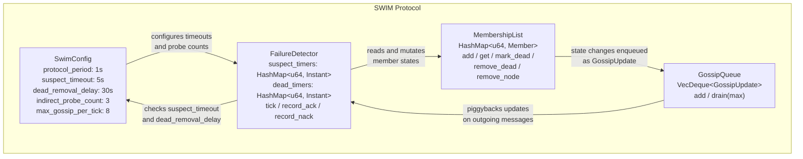
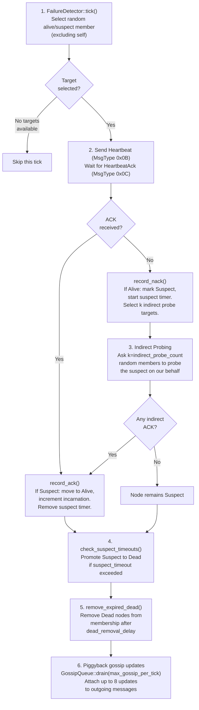
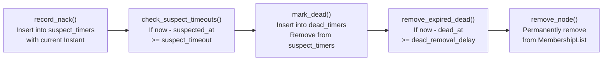

# SWIM Protocol Internals

This document describes the internals of Rebar's SWIM (Scalable Weakly-consistent Infection-style Membership) protocol implementation. All code lives in `crates/rebar-cluster/src/swim/`.

## What is SWIM?

SWIM is a membership protocol designed for large-scale distributed systems. It was introduced in the paper [*SWIM: Scalable Weakly-consistent Infection-style Process Group Membership Protocol*](https://www.cs.cornell.edu/projects/Quicksilver/public_pdfs/SWIM.pdf) (Das et al., 2002).

Key properties:

- **O(1) message overhead per protocol period** -- each node probes exactly one random member per tick, regardless of cluster size.
- **Epidemic-style dissemination** -- membership changes propagate by piggybacking on protocol messages rather than using dedicated gossip rounds.
- **Bounded false positive rate** -- indirect probing and incarnation numbers minimize incorrect failure declarations caused by transient network issues.

Rebar's implementation follows the original SWIM paper with gossip piggybacking. The four core modules are:

| Module | File | Purpose |
|--------|------|---------|
| `SwimConfig` | `config.rs` | Protocol tuning parameters |
| `MembershipList` / `Member` | `member.rs` | Node tracking and state transitions |
| `FailureDetector` | `detector.rs` | Health monitoring and probe orchestration |
| `GossipQueue` / `GossipUpdate` | `gossip.rs` | State change dissemination |

## Architecture



## Node State Machine

Every `Member` in the `MembershipList` occupies one of three states defined by the `NodeState` enum in `member.rs`:

```rust
pub enum NodeState {
    Alive,
    Suspect,
    Dead,
}
```

Transitions between states follow strict rules enforced by the `Member` methods (`suspect()`, `alive()`, `dead()`):

```mermaid
stateDiagram-v2
    [*] --> Alive : Member::new()

    Alive --> Suspect : Direct probe fails (no ACK)
    Suspect --> Alive : ACK received (incarnation bumped)
    Suspect --> Dead : suspect_timeout exceeded (5s)
    Dead --> Removed : dead_removal_delay exceeded (30s)

    Removed --> [*]
```

Important constraints from the implementation:

- **Dead is terminal.** Once `member.dead()` is called, neither `alive()` nor `suspect()` can revive the node. Both methods check `if self.state == NodeState::Dead { return; }`.
- **Incarnation guards suspect.** `member.suspect(incarnation)` only transitions to Suspect if `incarnation >= self.incarnation`. Stale suspicions with a lower incarnation are ignored.
- **Incarnation guards alive.** `member.alive(incarnation)` only transitions to Alive if `incarnation > self.incarnation` (strictly greater). This prevents replayed or stale Alive messages from overriding a legitimate suspicion.

## Protocol Period (Tick Loop)

Each protocol period (default: 1 second), the failure detection loop executes the following steps:



## Direct Probing

Direct probing is the primary failure detection mechanism. Each tick, `FailureDetector::tick()` selects a random member from the membership list:

```rust
pub fn tick(&self, members: &MembershipList, self_id: u64) -> Option<u64> {
    let mut rng = rand::rng();
    members
        .all_members()
        .filter(|m| m.node_id != self_id && m.state != NodeState::Dead)
        .choose(&mut rng)
        .map(|m| m.node_id)
}
```

Selection criteria:
- Excludes the local node (`self_id`).
- Excludes Dead nodes (they are already declared failed).
- Includes both Alive and Suspect nodes (Suspect nodes can still be probed to confirm or refute suspicion).

**On ACK received** -- `record_ack()` is called:
- If the node was Suspect, it transitions back to Alive and its `incarnation` is incremented.
- The suspect timer for that node is removed.

**On no ACK** -- `record_nack()` is called:
- If the node was Alive, it transitions to Suspect via `member.suspect(member.incarnation)`.
- A suspect timer is recorded: `suspect_timers.entry(node_id).or_insert(now)`.
- Only the first NACK starts the timer (subsequent NACKs for an already-suspect node do not reset it).

## Indirect Probing

When a direct probe fails and a node becomes Suspect, the protocol initiates indirect probing:

1. Select `indirect_probe_count` (default: 3) random **alive** members from the membership list (using `MembershipList::random_alive_member()`).
2. Send each selected member a request to probe the suspect node on our behalf.
3. Each intermediary sends a Heartbeat to the suspect and relays any HeartbeatAck back to the originator.
4. If **any** indirect probe receives an ACK, `record_ack()` is called -- the suspect is cleared and moved back to Alive with an incremented incarnation.
5. If **no** indirect probes succeed, the node remains Suspect and the suspect timer continues counting down.

Indirect probing mitigates false positives caused by asymmetric network partitions or temporary congestion on a single link between two nodes.

## Incarnation Numbers

Each `Member` carries a `u64` incarnation counter, initialized to 0 when the member is created:

```rust
pub struct Member {
    pub node_id: u64,
    pub addr: SocketAddr,
    pub state: NodeState,
    pub incarnation: u64,
}
```

Incarnation numbers serve as a logical clock for resolving conflicting state information about a node:

- **Suspecting a node**: `member.suspect(incarnation)` only succeeds if `incarnation >= self.incarnation`. A suspicion with a lower incarnation than the node's current incarnation is stale and ignored.
- **Refuting a suspicion**: `member.alive(incarnation)` only succeeds if `incarnation > self.incarnation` (strictly greater). The suspected node increments its own incarnation and broadcasts an Alive gossip update with the higher value.
- **On ACK after suspicion**: `record_ack()` increments the member's incarnation (`member.incarnation += 1`), ensuring the refutation overrides any in-flight suspicion gossip.

This mechanism prevents cascading false positives from stale gossip messages. A node that was transiently unreachable can refute its own suspected state by proving liveness with a higher incarnation number.

## Gossip Piggybacking

Rather than using dedicated gossip rounds, Rebar piggybacks membership state changes on existing protocol messages (Heartbeat, HeartbeatAck, and other inter-node communication).

### GossipUpdate Variants

Defined in `gossip.rs`, all variants are serializable via `serde` and encoded with MessagePack (`rmp_serde`):

```rust
pub enum GossipUpdate {
    Alive { node_id: u64, addr: SocketAddr, incarnation: u64 },
    Suspect { node_id: u64, addr: SocketAddr, incarnation: u64 },
    Dead { node_id: u64, addr: SocketAddr },
    Leave { node_id: u64, addr: SocketAddr },
}
```

| Variant | Meaning | Fields |
|---------|---------|--------|
| `Alive` | Node is alive (joins or refutes suspicion) | `node_id`, `addr`, `incarnation` |
| `Suspect` | Node is suspected of failure | `node_id`, `addr`, `incarnation` |
| `Dead` | Node has been declared dead | `node_id`, `addr` |
| `Leave` | Node is gracefully leaving the cluster | `node_id`, `addr` |

Note that `Dead` and `Leave` do not carry an `incarnation` field -- once a node is dead or leaving, incarnation numbers are no longer relevant.

### GossipQueue

The `GossipQueue` is a FIFO queue backed by `VecDeque<GossipUpdate>`:

```rust
pub struct GossipQueue {
    queue: VecDeque<GossipUpdate>,
}
```

- **`add(update)`** -- pushes a `GossipUpdate` to the back of the queue.
- **`drain(max)`** -- removes and returns up to `max` updates from the front of the queue. If fewer than `max` updates are queued, all available updates are returned.

Each tick, `drain(max_gossip_per_tick)` is called (default: 8) and the returned updates are attached to outgoing protocol messages. This bounds the per-message gossip overhead while ensuring all updates eventually propagate.

## Configuration

The `SwimConfig` struct holds all tunable parameters. A builder pattern (`SwimConfigBuilder`) provides ergonomic construction:

```rust
let config = SwimConfig::builder()
    .protocol_period(Duration::from_millis(500))
    .suspect_timeout(Duration::from_secs(10))
    .indirect_probe_count(5)
    .build();
```

### Parameter Reference

| Parameter | Type | Default | Description | Tuning Guidance |
|-----------|------|---------|-------------|-----------------|
| `protocol_period` | `Duration` | 1s | How often the protocol runs a probe cycle. | Lower values detect failures faster but increase network traffic linearly. For latency-sensitive systems, 500ms is reasonable. For large clusters (100+ nodes), 2s reduces overhead. |
| `suspect_timeout` | `Duration` | 5s | How long a node stays Suspect before being declared Dead. | Lower values promote faster Dead declaration but increase false positive risk. Should be at least 3-5x the expected network RTT. For WAN deployments, 10-15s is safer. |
| `dead_removal_delay` | `Duration` | 30s | How long a Dead node remains in the membership list before removal. | Allows gossip to propagate the death notification and gives the node a window to rejoin if it was falsely declared dead. Increase for high-latency networks. |
| `indirect_probe_count` | `usize` | 3 | Number of random members asked to probe a suspect on our behalf. | More probes improve false positive resistance but increase per-failure message overhead. 3 is sufficient for most deployments. Increase to 5 for unreliable networks. |
| `max_gossip_per_tick` | `usize` | 8 | Maximum gossip updates piggybacked per protocol tick. | More updates per tick means faster convergence but larger messages. For clusters under 50 nodes, 8 is generous. For 1000+ node clusters, consider 16-32. |

## Failure Detector Implementation

The `FailureDetector` struct in `detector.rs` is the core state machine driver. It maintains two timer maps and exposes methods that the protocol loop calls each tick.

### Internal State

```rust
pub struct FailureDetector {
    suspect_timers: HashMap<u64, Instant>,
    dead_timers: HashMap<u64, Instant>,
}
```

- **`suspect_timers`** -- maps `node_id -> Instant` recording when the node was first suspected. Used by `check_suspect_timeouts()` to determine if `suspect_timeout` has elapsed.
- **`dead_timers`** -- maps `node_id -> Instant` recording when the node was declared Dead. Used by `remove_expired_dead()` to determine if `dead_removal_delay` has elapsed.

### Method Reference

| Method | Signature | Behavior |
|--------|-----------|----------|
| `tick()` | `fn tick(&self, members: &MembershipList, self_id: u64) -> Option<u64>` | Select a random non-self, non-Dead member to probe. Returns `None` if no targets exist. |
| `record_ack()` | `fn record_ack(&mut self, members: &mut MembershipList, node_id: u64)` | If the node is Suspect, move to Alive and increment incarnation. Remove the suspect timer. |
| `record_nack()` | `fn record_nack(&mut self, members: &mut MembershipList, node_id: u64, now: Instant)` | If the node is Alive, mark Suspect and start a suspect timer (only on first NACK). |
| `check_suspect_timeouts()` | `fn check_suspect_timeouts(&mut self, members: &mut MembershipList, config: &SwimConfig, now: Instant) -> Vec<u64>` | Scan all suspect timers. Any node suspected for longer than `suspect_timeout` is promoted to Dead. Returns newly dead node IDs. |
| `remove_expired_dead()` | `fn remove_expired_dead(&mut self, members: &mut MembershipList, config: &SwimConfig, now: Instant) -> Vec<u64>` | Scan all dead timers. Any node dead for longer than `dead_removal_delay` is removed from the membership list entirely. Returns removed node IDs. |

### Timeout Flow



## Convergence

SWIM's gossip mechanism provides probabilistic convergence guarantees:

- Each protocol tick, a node selects a random member to probe and piggybacks gossip updates on the probe message.
- Each node that receives gossip updates integrates them into its local membership list and can further propagate them in subsequent ticks.
- Since each node independently selects random targets, information spreads epidemically -- each informed node tells `k` others, who each tell `k` more.

For a cluster of N nodes, a single membership change propagates to all nodes in **O(log N)** protocol periods. With the default configuration:

- A 10-node cluster converges in ~4 ticks (~4 seconds).
- A 100-node cluster converges in ~7 ticks (~7 seconds).
- A 1000-node cluster converges in ~10 ticks (~10 seconds).

All membership changes -- joins (Alive), suspicions (Suspect), failures (Dead), and graceful departures (Leave) -- are eventually propagated to all nodes. The `max_gossip_per_tick` parameter bounds the per-message overhead while ensuring the queue drains over successive ticks.

---

## See Also

- [rebar-cluster API Reference](../api/rebar-cluster.md) -- public API for `Member`, `MembershipList`, `SwimConfig`, `FailureDetector`, and `GossipQueue`
- [Wire Protocol Internals](wire-protocol.md) -- the Heartbeat and HeartbeatAck frame types used by SWIM probes
- [CRDT Registry Internals](crdt-registry.md) -- the registry uses SWIM node-down events to trigger `remove_by_node()` cleanup
- [Architecture](../architecture.md) -- how the SWIM module fits into the rebar-cluster crate
